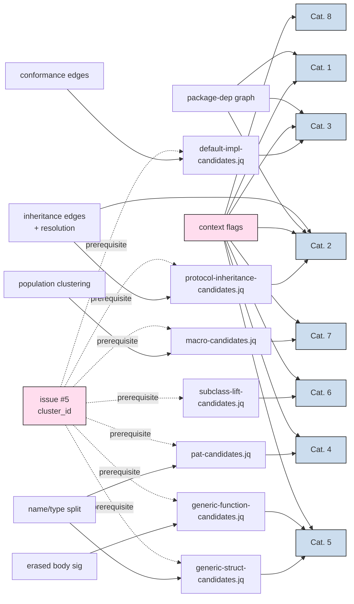
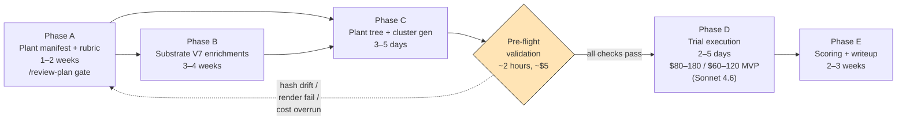

# Refactor-Recommendation Experiment — Methodology

> Companion to the substrate-fidelity experiments documented in V2–V6 ([V2 results](dj-site-divergence-experiment-v2-results.md), [V3 manifest](dj-site-divergence-experiment-v3-plant-manifest.md), [V3 results](dj-site-divergence-experiment-v3-results.md), [V4 results](dj-site-divergence-experiment-v4-results.md), [V5 results](dj-site-divergence-experiment-v5-results.md), [wxyc-ios-64 V6 manifest](wxyc-ios-64-experiment-plant-manifest.md), [wxyc-ios-64 V6 results](wxyc-ios-64-experiment-results.md)). Those experiments measured whether the substrate emits structural rhymes; this experiment measures whether substrate-plus-agent converts surfaced rhymes into **actionable refactor recommendations**. The [top-level README](../README.md) frames the project's deliverable as "duplicate types, missed abstractions, and pattern drift" with the agent's role being judgment on whether a cluster is "consolidate-worthy" — V7 extends that toward *which* consolidation (the specific Swift / TypeScript refactor) the cluster is calling for. Before V7 lands, the README should be updated to match.

## Executive summary

V2–V6 built and validated a substrate that catalogs structural rhymes (duplicates, shadows, near-duplicates, subsets, function-body matches) across a codebase and surfaces them as cluster rows for an agent to read. V5 hit 100% per-plant recall on dj-site; V6 hit 19/20 on Swift. The substrate-fidelity axis is closed.

What's untested: when an agent reads those cluster rows, does it produce a refactor recommendation that's actionable, correct, grounded in cluster evidence, and specific enough to land? V7 is that experiment. The design uses 40 planted refactor opportunities across 8 categories (extract-to-common, protocol inheritance, default impl, PAT, generic parameterization, subclass lift, macro synthesis, composition) plus 8 restraint twins that share the cluster signal but where action is the *wrong* answer. Three conditions compare cold agent (S0), V6 substrate (S1), V7 substrate (S2). Trial cost at Sonnet 4.6 rates (the round-1 pin per [§17 decision #2](#decisions-outstanding)): $80–180 for the full round, $60–120 for the [MVP](#mvp); wallclock 7–11 weeks vs. 4–6 weeks.

Success looks like S2 outperforming S0 by ≥10pp per-category recall on at least 5 of 8 categories, restraint false-positive rate below 25%, and a synthetic-to-natural transfer gap below 0.3 on the rubric scale. Failure modes are enumerated in [§14 pre-mortem](#pre-mortem); each carries a defined diagnostic signature and recovery path.

## TL;DR (for the impatient)

- **The deliverable:** the project ships actionable refactor recommendations. V7 measures whether the substrate-plus-agent system actually produces them.
- **The plant set:** 40 planted refactor opportunities across 8 Swift refactoring categories, each with a restraint twin testing false-positive resistance.
- **The substrate work:** 8 enrichments to the V6 substrate (name/type split, conformance edges, inheritance edges, erased body sig, package-dep graph, context flags, population clustering, plus issue #5 cluster IDs as prerequisite).
- **The rubric:** auto-scored against pre-registered per-plant expected answers with alternative-answer weights and `specifics_tolerance` bands; novel-but-defensible recommendations route to panel.
- **The cost:** $60–120 (MVP, 4–6 weeks) to $80–180 (full round, 7–11 weeks) at Sonnet 4.6 rates per [§17 decision #2](#decisions-outstanding); 5× higher at Opus 4.7 rates if round 2 escalates. Pre-flight + cost-control gates in [§15](#roadmap) cap downside risk.
- **What's open:** nine pre-kickoff decisions enumerated in [§17](#decisions-outstanding) — model pinning, panel composition, MVP vs full, plant-tree serving strategy, weak-rationale scoring policy, others.

## Audience pointers

Read these sections if you're a:

- **Stakeholder / sponsor.** Executive summary above, [§1 baseline numbers](#background), [§15 roadmap and cost](#roadmap), [§17 decisions outstanding](#decisions-outstanding). Skim the rest.
- **Methodology reviewer (`/review-plan` or equivalent).** [§5 plant design](#plant-design) including the [§5.9 summary matrix](#summary-matrix), [§8 scoring rubric](#scoring-rubric), [§10 pre-registration and reproducibility](#pre-registration), [§13 risks](#risks), [§14 pre-mortem](#pre-mortem). Companion: [`plant-manifest.md`](refactor-recommendation-experiment-plant-manifest.md) for the per-plant YAML schema.
- **Substrate implementer (Phase B).** [§5.9 summary matrix](#summary-matrix), [§6 enrichments](#substrate-enrichments) including the [§6.8 dependency graph](#enrichment-new-queries), [§14.4 batching variance failure mode](#pre-mortem). Companion: [`macro-candidates.md`](refactor-recommendation-experiment-macro-candidates.md) for the population-clustering query.
- **Trial harness implementer (Phase C/D).** [§7 agent prompt design](#agent-prompt), [§15 roadmap](#roadmap) including pre-flight and cost-control gates, [§20 worked-example scoring](#worked-example). Companion: [`agent-prompt.md`](refactor-recommendation-experiment-agent-prompt.md) for the full prompt and schemas.
- **Future-experiment designer (post-V7).** [§19 forward roadmap](#forward-roadmap), [`future-directions.md`](future-directions.md) for the project-level capability roadmap.
- **Reader of V6 results who's wondering "wait, is 19/20 not the answer?".** [§18 V6 postscript](#v6-postscript) — V6 closed the input layer, V7 measures the output layer; both necessary.

## Table of contents

1. [Background: what the prior experiments measured, and didn't](#background)
2. [The reframe: rhymes signal missing abstractions](#reframe)
3. [What we're measuring](#what-were-measuring)
4. [Why this is harder than substrate-fidelity](#why-harder)
5. [Plant design: refactor categories](#plant-design)
   - 5.1 [Category 1 — Extract-to-common](#cat-1-extract-to-common)
   - 5.2 [Category 2 — Protocol inheritance](#cat-2-protocol-inheritance)
   - 5.3 [Category 3 — Default implementation](#cat-3-default-implementation)
   - 5.4 [Category 4 — PAT introduction](#cat-4-pat-introduction)
   - 5.5 [Category 5 — Generic parameterization](#cat-5-generic-parameterization)
   - 5.6 [Category 6 — Subclass lift](#cat-6-subclass-lift)
   - 5.7 [Category 7 — Macro synthesis](#cat-7-macro-synthesis)
   - 5.8 [Category 8 — Composition over inheritance](#cat-8-composition)
   - 5.9 [Category-to-substrate summary matrix](#summary-matrix)
6. [Substrate enrichments V7 needs](#substrate-enrichments)
7. [Agent prompt design](#agent-prompt)
8. [Scoring rubric](#scoring-rubric)
9. [Restraint and false-positive measurement](#restraint)
10. [Pre-registration discipline](#pre-registration)
11. [Conditions to compare](#conditions)
12. [What this experiment can't measure](#cant-measure)
13. [Risks specific to this experiment](#risks)
14. [Pre-mortem: failure modes, diagnostics, recovery](#pre-mortem)
15. [Implementation roadmap](#roadmap)
16. [Minimum viable round](#mvp)
17. [Decisions outstanding before kickoff](#decisions-outstanding)
18. [What this changes about how to talk about V6](#v6-postscript)
19. [Forward roadmap: V7 → V8 → V9](#forward-roadmap)
20. [Worked-example scoring walkthrough](#worked-example)

Companion docs (split for navigability; full details live in the dedicated docs, with cross-references from the methodology body where relevant):

- [`refactor-recommendation-experiment-plant-manifest.md`](refactor-recommendation-experiment-plant-manifest.md) — per-plant manifest YAML schema with one canonical entry per category plus a restraint twin.
- [`refactor-recommendation-experiment-agent-prompt.md`](refactor-recommendation-experiment-agent-prompt.md) — full agent prompt text, per-category specifics schemas, and the normalized cluster-row input shape.
- [`refactor-recommendation-experiment-macro-candidates.md`](refactor-recommendation-experiment-macro-candidates.md) — `macro-candidates.jq` algorithmic sketch and extractor-side `template_sig` precomputation.

<a id="background"></a>

## 1. Background: what the prior experiments measured, and didn't

The substrate (the [type-catalog](pipeline-contract.md#type-catalog-type-catalogjson), the [function-catalog](pipeline-contract.md#function-catalog-function-catalogjson), and the [file-hash catalog](pipeline-contract.md#file-hash-catalog-file-hashesjson)) plus the eight [pipeline queries](../pipeline/queries) produces structured "rhyme" findings (exact duplicates, cross-package shadows, subset-pairs, near-duplicates, function-body Jaccard pairs, file-content duplicates). V2–V4 were the iterations that surfaced substrate gaps (function-body duplication, file-content hashing, cross-package shape near-duplicates, intersection-type field resolution) where the early substrate had close-to-zero recall on the substrate-gap plant category. V5 closed those gaps on dj-site and hit 100% per-plant recall across 20 plants ([V5 results](dj-site-divergence-experiment-v5-results.md)). V6 ported the substrate to wxyc-ios-64 Swift and hit 19/20 plants with one Swift-specific predicted gap ([V6 results](wxyc-ios-64-experiment-results.md)). Across V5 and V6, that's 39/40 plant-trial cells surfacing — but the claim of "complete substrate" applies to the **post-V5-closures** substrate, not to the substrate at every prior version. Intra-trial Jaccard on cluster IDs converged to 1.00 in V5 — three pipeline-aware agent trials produced byte-identical cluster ID sets ([V5 results, "Intra-trial agreement"](dj-site-divergence-experiment-v5-results.md#intra-trial-agreement)).

The per-category substrate-fidelity numbers V3 → V6 (pipeline-aware C3 / S2 condition, the apples-to-apples comparison across versions):

| Plant category | V3 (dj-site) | V4 (dj-site, decontaminated) | V5 (dj-site, post-closure) | V6 (wxyc-ios-64, Swift) |
|---|---|---|---|---|
| exact-duplicates | 100% | 100% | 100% (4/4) | 100% (4/4) |
| cross-package-shadows | 100% | **60%** (batching variance) | 100% (4/4) | 100% (4/4) |
| subset-pairs | 100% | 100% | 100% (4/4) | 100% (4/4) |
| near-duplicates | 100% | 100% | 100% (4/4) | 100% (4/4) |
| substrate-gap | **0%** (no surface) | **0%** (still no surface) | **100% (4/4)** | 100% (3/4) + 1 expected gap |

Sources: [V3](dj-site-divergence-experiment-v3-results.md#per-category-recall-fraction-of-plants-detected-averaged-over-trials--plants), [V4](dj-site-divergence-experiment-v4-results.md#per-category-recall), [V5](dj-site-divergence-experiment-v5-results.md#per-plant-recall), [V6](wxyc-ios-64-experiment-results.md#per-category-recall). Two notes:

- **V4's cross-package-shadows drop to 60%** is the "score every row" batching variance ([V4 results, §2](dj-site-divergence-experiment-v4-results.md#2-c3-cross-package-shadows-recall-100--60-the-score-every-row-batching-variance)) — 2 of 5 trials batched 13 shadow rows into 3 grouped findings. This is the open methodological issue the [§6 issue #5 prerequisite](#substrate-enrichments) and the [§13 risks list](#risks) carry forward into V7.
- **Substrate-gap 0% → 100% from V4 to V5** is the entire V5 substrate-closure work landing in one column. The four planted gaps (function-body, file-content, cross-package shape near-duplicate, intersection-subset) all became queryable.

The cold-agent (S0 analog) numbers from the same experiments tell a separate story. V3 reported cold-agent substrate-gap recall at 95% — but V4 demonstrated that headline was inflated by `// Plant N` comment leaks and `git status` plant-tree visibility; after decontamination, V4 cold-agent substrate-gap recall fell to 50%, with one plant (cross-package near-duplicate, plant 19) collapsing from 100% to 0% ([V4 results, §1](dj-site-divergence-experiment-v4-results.md#1-c4-substrate-gap-recall-95--50-the-comment-leak-bias)). V3 and V4 also documented a cold-agent `.tsx` blind spot — 0 of 25 trial-plant cells on `.tsx` files ([V3 results, "Cold-agent attention biases"](dj-site-divergence-experiment-v3-results.md)). Both findings reappear in V7's [contamination-vectors discipline](#pre-registration) and [language-specific blind-spot risk](#conditions).

Natural-findings baseline (qualitative, no ground-truth labels): V6's unmodified-codebase output flagged `DebugMetricsProvider` byte-identical across two packages, `PlayerState` vs `PlaybackState` at 83% Jaccard with parallel computed-property extensions at 85%, and `StreamingService` vs `MusicServiceIdentifier` enums at 83% across Metadata and MusicShareKit ([V6 results, "Conclusion"](wxyc-ios-64-experiment-results.md#conclusion)). The natural baseline can't be expressed as a percentage because there's no ground-truth set of "all refactor opportunities in wxyc-ios-64"; what it does establish is that the substrate-plus-queries produce non-trivial findings on real code, not just planted code. V7's [natural-findings sub-experiment](#cant-measure) measures whether the *recommendation* layer over those clusters is also non-trivial.

Those experiments tested *substrate fidelity*: does the rhyme make it from source into a structured cluster row that an agent can read? They did not test *recommendation quality*: given the cluster row, does the agent recommend a refactor in the right category, with adequate specificity, with grounded rationale, without false-positive action on intentional clusters? Recommendation quality is the project's working definition of its deliverable (see the README discussion above for the gap between that and the README's current wording), and it has been untested. This document specifies the experiment that tests it.

<a id="reframe"></a>

## 2. The reframe: rhymes signal missing abstractions

The substrate's role is not to find duplications and propose deduplication. It is to find structural rhymes that signal an *unrealized abstraction*. Each cluster type fingerprints a different kind of missing abstraction:

| Cluster signal (existing in V6) | Abstraction the rhyme hints at |
|---|---|
| Exact-duplicates across packages ([`exact-duplicates.jq`](../pipeline/queries/exact-duplicates.jq)) | A concept wants a name and a shared home |
| Cross-package shadows ([`cross-package-shadows-any.jq`](../pipeline/queries/cross-package-shadows-any.jq)) | Two teams reinvented the same noun with divergent intent — disambiguation or boundary clarification needed |
| Subset-pairs ([`subset-pairs.jq`](../pipeline/queries/subset-pairs.jq)) | "B is A plus more" — protocol inheritance, composition, or a generic |
| Near-duplicates ([`near-duplicates-any.jq`](../pipeline/queries/near-duplicates-any.jq)) | A parameterizable axis exists; the differing field/method *is* the parameter |
| Function-body Jaccard ([`function-duplicates.jq`](../pipeline/queries/function-duplicates.jq)) | The body has a parameterizable axis — default impl + protocol witness, or one generic function |
| Cross-package, different name, same shape ([`cross-package-shape-near-duplicates-any.jq`](../pipeline/queries/cross-package-shape-near-duplicates-any.jq)) | A concept is being independently reinvented across a boundary; suggests a shared module or protocol that captures the contract |
| Extension-fragmented + sibling unified ([V6 results, "The expected gap"](wxyc-ios-64-experiment-results.md#the-expected-gap-extension-fragmented-types)) | Fragmentation may be intentional module-org and the unified sibling is the outsider, or the type wants consolidation — direction is a judgment call |

The taxonomy of Swift (or TypeScript) refactorings — subclass, protocol inheritance, default implementation, PAT, macro synthesis, generic parameterization, composition — is the *reader's vocabulary for answering the substrate's complaint*, not the substrate's vocabulary for making it. The substrate says "these N things rhyme." The agent's job is to say "so that means the missing abstraction is X." That mapping from rhyme to abstraction is what the V7 experiment measures, and it is independent of the rhyme-detection axis that V2–V6 measured.

<a id="what-were-measuring"></a>

## 3. What we're measuring

A refactor recommendation has four components:

- **Target** — which cluster, which files, which symbols.
- **Action** — the change to make, named in a fixed taxonomy of refactor categories ([§7](#agent-prompt)).
- **Rationale** — evidence from the cluster output that supports the action, ideally with a literal quote from the cluster row.
- **Alternative** — an optional defensible second-choice action with its own rationale.

A recommendation is **actionable** if a competent engineer can land the change from the recommendation alone, **correct** if the recommended change addresses the structural issue the cluster surfaced, **grounded** if the rationale cites cluster evidence rather than restating it, and **specific** if the named files/symbols/packages are precise enough to act on without further analysis.

The primary measurement is per-plant: did the agent produce a recommendation in the right [category](#plant-design), with adequate specificity, with grounded rationale, without false-positive action on a [restraint twin](#restraint)? Aggregate metrics are defined in [§8](#scoring-rubric).

<a id="why-harder"></a>

## 4. Why this is harder than substrate-fidelity

Three structural differences from V5/V6, each of which forces methodological additions:

**Multi-valued right answers.** A cross-package shape match could be addressed by extract-to-common ([Cat. 1](#cat-1-extract-to-common)), by protocol-of-shared-fields with both types conforming ([Cat. 2](#cat-2-protocol-inheritance)), or by a generic wrapper ([Cat. 5](#cat-5-generic-parameterization)). All three are defensible; the choice depends on context (whether the types ever vary independently, whether callers want polymorphism, whether the types will diverge in maintenance). The [rubric](#scoring-rubric) encodes primary plus alternative answers and grants partial credit for adjacent-but-defensible categories.

**"No action" is sometimes correct.** Tests share shape with the production types they exercise. Sample apps mirror production. Wire DTOs intentionally rhyme with view models. The agent has to recognize intentional duplications and not act on them. This is a specificity axis V2–V6 don't measure — they count plants-found and never plants-falsely-recommended. The [restraint section](#restraint) is the new instrument for measuring it.

**Grounding gradients.** Two recommendations can name the same refactor and differ wildly in quality. "These have the same shape, extract to common" is a weak rationale. "These have the same shape, both files import the same downstream consumers, and the cross-package-shape-near-duplicates row shows Jaccard 1.0 with no diverging fields — extracting to `Core/Models` eliminates the redeclaration without changing any caller's import surface" is a strong rationale. Same category, different actionability. The [rubric](#scoring-rubric) has a grounding dimension separate from category-correctness.

These three together — multi-valued correctness, specificity, grounding — turn the binary cluster-ID match used in V2–V6 into a multidimensional judgment, which is why this is a fundamentally bigger experiment than substrate-fidelity.

<a id="plant-design"></a>

## 5. Plant design: refactor categories

Eight categories, four canonical plants each, plus one [restraint twin](#restraint) per category (a plant whose field-level shape matches its canonical counterpart but whose surrounding context — file location, naming convention, codegen markers, API-vs-impl boundary — marks it as an intentional duplication the agent should NOT act on). Total 8 × (4 canonical + 1 restraint) = 40 plants. A streamlined version with five categories is in [§16](#mvp).

Plants follow the [V3 de-abstraction methodology](dj-site-divergence-experiment-v3-plant-manifest.md#what-de-abstraction-means-here): take an existing well-abstracted construct, create a duplicate / subset / parallel variant whose existence would not be justified if the missing abstraction had been recognized. The plant is the placement of the missing-abstraction signal, not the invention of one. Plant source types are drawn from the isolated-source set verified absent from baseline cluster outputs ([V6 isolated-source procedure](wxyc-ios-64-experiment-plant-manifest.md#isolated-source-set)).

Each plant's manifest entry includes: source type, plant location, expected substrate signals (which clusters it should appear in), expected primary refactor category, alternative defensible categories, wrong-answer categories with notes on what makes each wrong, and a `restraint_pair` reference if it has a twin.

**Note on the recommendation taxonomy.** The agent prompt ([§7](#agent-prompt)) enumerates eleven recommendation categories (the eight plant categories plus `extension-consolidation`, `no-action`, and `other`). `extension-consolidation` is a valid Swift refactor pattern but not a planted plant category for this round — an agent recommending it for a Cat. 1–8 plant is scored as a wrong-category answer; for natural-findings sub-experiments, it's a legitimate primary answer. The plant set is a subset of the recommendation taxonomy, not a partition.

<a id="cat-1-extract-to-common"></a>

### 5.1 Category 1 — Extract-to-common

**Substrate signal it sits on:** [`exact-duplicates.jq`](../pipeline/queries/exact-duplicates.jq), [`cross-package-shape-near-duplicates-any.jq`](../pipeline/queries/cross-package-shape-near-duplicates-any.jq). Subsumes V5/V6's exact-duplicates and cross-package-different-name plant categories.

**Substrate enrichment used:** [package-dependency graph](#enrichment-package-graph) for plants 1.1–1.3 so the recommendation can name a *specific* extraction target package (the one already upstream of both consumers). Plant 1.4 (within-package consolidation) needs no new substrate beyond V6.

**Plant 1.1 — Canonical.** Three identical `struct Configuration { url, timeout, retries, headers }` declarations in three Shared packages, none depending on each other. Right answer: extract to a fourth common package (or a new shared module each can import). Alternative (weight 0.7): extract to one of the three if all three callers can be flipped to import from it.

**Plant 1.2 — Asymmetric dependency.** Two identical declarations, but one package already depends transitively on the other. Right answer: move the declaration to the upstream package, import from the downstream. The target is uniquely determined by the [package-dependency graph](#enrichment-package-graph); a recommendation that names the wrong target loses partial credit.

**Plant 1.3 — Cross-app duplicates.** Same shape in `app:iOS` and `app:WatchXYC`. Right answer: extract to a Shared package both apps already depend on (e.g., `Shared/Core`).

**Plant 1.4 — Within-package consolidation.** Two structs with identical shape in different files of the same package. Right answer: consolidate to one declaration in the more sensible file (the one whose surrounding context relates to the type). The package-dependency graph isn't relevant here — the extraction target is determined by intra-package file structure, not by inter-package upstream/downstream — so this plant tests whether the agent recognizes when the dependency graph *isn't* needed and falls back to file-locality reasoning.

**Restraint 1R — Test-vs-production.** Identical struct shapes; one in production (`Shared/Foo/Sources/Foo/`), one in test (`Shared/Foo/Tests/FooTests/`). Right answer: no-action. The mock exists *because of* its shape parallel; consolidating would break test isolation. The substrate should flag this via [is_test markers](#enrichment-context-flags).

<a id="cat-2-protocol-inheritance"></a>

### 5.2 Category 2 — Protocol inheritance

**Substrate signal:** [`subset-pairs.jq`](../pipeline/queries/subset-pairs.jq) where both sub and super have `kind == "interface"` (protocols).

**Substrate enrichment required:** [protocol-inheritance edges and resolution](#enrichment-inheritance-edges). Edges let the substrate distinguish protocols-already-inheriting from independently-declared parallel protocols. Resolution (field union from parent into child) is what lets `subset-pairs.jq` see a planted parallel protocol as a subset/superset of a child protocol whose total surface includes inherited requirements — without resolution, the child's declared-only fields would mismatch the parallel protocol's full fields.

**Plant 2.1 — Canonical.** `protocol BasicPlayer { play, pause, currentTime }` and `protocol AdvancedPlayer { play, pause, currentTime, seek, rate, seekableTimeRanges }` declared independently in the same package. Right answer: `protocol AdvancedPlayer: BasicPlayer { seek, rate, seekableTimeRanges }`.

**Plant 2.2 — Cross-package subset.** Same pattern but the protocols live in different packages. Right answer depends on direction: if upstream owns BasicPlayer and downstream owns AdvancedPlayer, inherit; otherwise extract BasicPlayer to a shared upstream first, then inherit. Tests whether the agent reasons about [package-dependency graph](#enrichment-package-graph) before recommending inheritance.

**Plant 2.3 — Three-level chain.** Protocols A, B, C with member sets nested A ⊂ B ⊂ C, all declared independently. Right answer: `protocol B: A`, `protocol C: B`. Tests recognition of chained inheritance rather than flat parallel decls.

**Plant 2.4 — Siblings with missing common parent.** Protocols `Cacheable` and `Persistable` that both have a shared core (e.g., `var id: String { get }; var displayName: String { get }`) that doesn't exist as its own protocol yet. Right answer: introduce the shared parent (or reuse Swift's `Identifiable` if applicable) and re-parent both. Tests recognition of *missing* common ancestry.

**Restraint 2R — Parallel but independent.** Two protocols that share most members but encode genuinely different contracts (a `UIComponent` protocol and a `DataSource` protocol that both require `id` and `displayName` coincidentally). Right answer: no-action — the shared shape is incidental.

<a id="cat-3-default-implementation"></a>

### 5.3 Category 3 — Default implementation

**Substrate signal:** [`function-duplicates.jq`](../pipeline/queries/function-duplicates.jq) where the clustered functions are all method-kind implementations on types that all conform to the same protocol.

**Substrate enrichment required:** [protocol-conformance edges](#enrichment-conformance-edges) — without them, the substrate sees method-body duplication but cannot link it to a common protocol's surface. Also [a new query, `default-impl-candidates.jq`](#enrichment-new-queries), that cross-references function-duplicates against conformance edges and emits "N types conforming to P, all implementing method `foo` identically" rows.

**Plant 3.1 — Canonical.** Protocol `Loggable` with method `logDebugInfo()`. Three conforming types each implement `logDebugInfo()` with identical bodies. Right answer: move the body to a `extension Loggable { func logDebugInfo() { ... } }` default; remove the conformer implementations.

**Plant 3.2 — Partial default with override.** Same as 3.1 but one conformer has a meaningfully different body. Right answer: default impl on the protocol extension, retained override on the divergent conformer (probably with a `// note: override` comment). Tests whether the agent recognizes that one outlier doesn't block the default-impl move.

**Plant 3.3 — No shared protocol yet.** N types with byte-identical method bodies for the same method name, but no shared protocol declaration. Right answer: extract a protocol with the method, give it the default impl, have all N conform. Two-step refactor; agent has to recognize the missing protocol.

**Plant 3.4 — Cross-package conformance.** Protocol in package A, conformers in packages B and C. Right answer: default impl on the protocol extension *in package A*, so B and C inherit it. Tests cross-package default-impl placement.

**Restraint 3R — Incidental body match.** N types with the same method name and same body, but no shared protocol and the method has different *meanings* in each (e.g., `reset()` on a network connection vs `reset()` on a UI state — both implementations call `self = .init()` but for unrelated reasons). Right answer: no-action — the body match is coincidental, lifting would couple unrelated concerns.

<a id="cat-4-pat-introduction"></a>

### 5.4 Category 4 — PAT introduction

**Substrate signal:** Pairs (or N-way clusters) of protocols where the **name shape is identical** but the **type shape differs at one or more slots**. Currently flattened into the field-encoding string in V6 substrate.

**Substrate enrichment required (critical):** [separated name/type tracking in type-catalog](#enrichment-name-type-split) so a new query can ask "find protocol pairs where name sets are identical but type slots differ." Without this enrichment, PAT-shaped pairs cluster as ordinary exact-duplicates or near-duplicates and the PAT-shaped signal is lost.

**Plant 4.1 — Canonical two-way.** Protocols `TrackContainer { var item: Track; func reload() async }` and `ShowContainer { var item: Show; func reload() async }`. Differ only at the `item` slot's type. Right answer: introduce `protocol Container { associatedtype Item; var item: Item { get }; func reload() async }`; replace both protocols.

**Plant 4.2 — Three-way PAT.** Three parallel protocols with the same name shape, three different types at the variable slot. Right answer: one PAT, three callers updated. Tests recognition at higher arity.

**Plant 4.3 — Constrained PAT.** Two protocols differing at one type slot, where both type-slot values conform to a common protocol (e.g., both are `Identifiable`). Right answer: `protocol Container { associatedtype Item: Identifiable; ... }` with the constraint named explicitly. Tests whether the agent extracts the type constraint.

**Plant 4.4 — PAT with effect specifiers.** Two protocols whose methods differ at one type slot AND carry Swift effect specifiers (`async`, `throws`, `rethrows`) on at least one signature. Right answer: PAT with the full signature preserved including effects (e.g., `func reload() async throws -> Item`). Tests whether the substrate's name/type tracking captures effect specifiers as part of the type-slot — without that, a `func reload() -> Item` protocol and a `func reload() async throws -> Item` protocol cluster as "differ only at return type" rather than "differ at both return type and effect specifiers," and the agent can't faithfully reproduce the original contracts.

**Restraint 4R — Parallel structure, independent intent.** Two protocols with parallel name shape and parallel type shape, but representing unrelated concepts (e.g., physics `MeasurementUnit` vs UI-spacing `MeasurementUnit`). Right answer: no-action.

<a id="cat-5-generic-parameterization"></a>

### 5.5 Category 5 — Generic parameterization (struct or function)

**Substrate signal:** Near-duplicates where the differing axis is a type at one or more slots, with the rest of the structure (field/parameter names, body shape) identical.

**Substrate enrichment required:** [function-body type-erased signature](#enrichment-erased-body-sig) so two function bodies that differ only by type substitutions cluster together; [separated name/type tracking](#enrichment-name-type-split) for the struct case.

**Plant 5.1 — Canonical generic struct.** `struct IntCache { entries: [Int: CacheEntry<Int>], capacity: Int, ... }` and `struct StringCache { entries: [String: CacheEntry<String>], capacity: Int, ... }`. Right answer: `struct Cache<Key: Hashable> { entries: [Key: CacheEntry<Key>], capacity: Int, ... }`.

**Plant 5.2 — Canonical generic function.** Two free functions differing only at the type of one parameter, body otherwise identical after type substitution. Right answer: one generic function with a type parameter.

**Plant 5.3 — Multi-parameter generic.** Two types differing at two type slots. Right answer: generic with two type parameters.

**Plant 5.4 — Constrained generic.** Two types where the variable axis is constrained (e.g., both type values conform to `Numeric`). Right answer: `<T: Numeric>` rather than unconstrained `<T>`.

**Restraint 5R — Specialized intentionally.** Two types parameterized differently for *performance reasons* (e.g., `Int8Cache` is SIMD-optimized; `StringCache` is a B-tree). Their shapes look like a generic-candidate pair but specialization is the point. Right answer: no-action.

<a id="cat-6-subclass-lift"></a>

### 5.6 Category 6 — Subclass lift / base-class consolidation

**Substrate signal:** [`function-duplicates.jq`](../pipeline/queries/function-duplicates.jq) where all clustered methods belong to classes sharing a common ancestor.

**Substrate enrichment required:** [class-inheritance edges](#enrichment-inheritance-edges); [a new query `subclass-lift-candidates.jq`](#enrichment-new-queries) that joins function-duplicates against class-inheritance edges and reports lift candidates with their nearest common ancestor.

**Plant 6.1 — Canonical.** Three classes `IOSViewModel`, `WatchViewModel`, `TVViewModel` all inheriting `BaseViewModel`, each redeclaring an identical `handleError(_:)` method. Right answer: move `handleError` to `BaseViewModel`.

**Plant 6.2 — Lift with one override.** Same as 6.1 but one subclass has a deliberately different override. Right answer: lift to base, retain the divergent override. Structural parallel to plant 3.2 but for classes, not protocols.

**Plant 6.3 — Missing base (Swift-idiomatic redirect).** Three classes with identical methods but *no shared base class*. Right answer in Swift: usually not "introduce a base class" but "introduce a protocol with default impl" ([Cat. 3](#cat-3-default-implementation)) — Swift idioms favor protocols over class hierarchies. Tests recognition of when subclass-lift is *not* the right answer.

**Plant 6.4 — Deep hierarchy.** Sibling classes three levels below a shared base, all redeclaring an identical method. Right answer: lift to the nearest common ancestor, not necessarily the root.

**Restraint 6R — Intentional shadow.** Sibling classes with byte-identical method bodies where the implementation calls a `self.platformSpecificHelper()` that resolves differently per subclass. The method body looks identical textually but its dynamic dispatch behavior differs. Right answer: no-action — lifting would collapse the platform-specific behavior.

<a id="cat-7-macro-synthesis"></a>

### 5.7 Category 7 — Macro synthesis

**Substrate signal:** *Population-level* (not pairwise) — N small declarations with structurally-identical boilerplate. Requires the substrate to cluster groups of ≥ N rows by template-match rather than pairs of rows by Jaccard.

**Substrate enrichment required:** [population clustering](#enrichment-population-clustering), the genuinely new algorithmic primitive in V7. Plus a new query `macro-candidates.jq` that consumes the population clusters and emits candidate macro shapes.

**Plant 7.1 — Display-name macro.** 18 enums, each with a parallel `var displayName: String` computed property switching over self's cases and returning a hardcoded string. Right answer: introduce a macro (`@CaseDisplayName` or equivalent). Alternative (weight 0.6): protocol-with-default-impl backed by `CaseIterable` + reflection.

**Plant 7.2 — Codable boilerplate.** 12 types, each manually implementing `init(from decoder:)` and `encode(to:)` with identical structure. Right answer: lean on Swift's built-in `Codable` synthesis — a macro opportunity that Swift already provides for free. Tests whether the agent recognizes the *built-in* macro before recommending custom-macro work.

**Plant 7.3 — Analytics events.** 25 small struct definitions each conforming to `AnalyticsEvent` with a parallel `eventName` and `properties` shape. Right answer: a macro mirroring the real `@AnalyticsEvent` macro that already lives at `Shared/AnalyticsMacros/Sources/AnalyticsMacrosPlugin/AnalyticsEventMacro.swift` in the wxyc-ios-64 repo (outside this project, so no relative link). The agent recognizing the macro pattern *and* recognizing the project already has the macro available is the strongest signal.

**Plant 7.4 — Builder pattern.** 8 types each with a parallel `Builder` nested struct providing `.with*()` methods returning a copy. Right answer: a macro that generates the builder.

**Restraint 7R — Parallel boilerplate, intentional.** 6 types with structurally identical methods that are deliberately handwritten for performance or explicit-control reasons (e.g., manual Codable for wire-format stability). Right answer: no-action.

<a id="cat-8-composition"></a>

### 5.8 Category 8 — Composition over inheritance

**Substrate signal:** [`subset-pairs.jq`](../pipeline/queries/subset-pairs.jq) where at least one of sub or super is a struct (Swift) or where the language-level inheritance mechanism would be unidiomatic.

**Substrate enrichment required:** Existing [`subset-pairs.jq`](../pipeline/queries/subset-pairs.jq) is sufficient; the discrimination between "subset → inheritance" (Cat. 2) and "subset → composition" (Cat. 8) is the *agent's* call based on the kinds of types involved.

**Plant 8.1 — Class subset, composition target.** `class FullProfile` has all of `class BasicProfile`'s fields plus more. Right answer: `class FullProfile { let basic: BasicProfile; let extra: ... }` — composition, not subclassing.

**Plant 8.2 — Struct subset.** Two structs where one's fields are a subset of the other's. Right answer: composition (`let core: BasicX`) or protocol-of-shared-fields with both conforming. Tests recognition that *structs can't inherit*, so composition is mechanically forced.

**Plant 8.3 — Struct-class subset.** Subset between a struct and a class. Right answer: protocol-of-shared-fields both conform to; agent should *not* recommend inheritance.

**Plant 8.4 — Required-vs-optional subset.** Sub has 3 required fields; super has those 3 + 2 optionals. Right answer: collapse to one struct with the 2 fields as `Optional`. Tests recognition that "subset" sometimes really means "missing-optionals."

**Restraint 8R — Intentional public/internal boundary.** A public-API struct and an internal-implementation struct, the latter having all of the former's fields plus internal-only bookkeeping. The duplication is the API/impl boundary. Right answer: no-action.

<a id="summary-matrix"></a>

### 5.9 Category-to-substrate summary matrix

The 8 categories, the existing or new substrate signal each sits on, the V7 enrichment each requires, the new query (if any) that implements the signal, and the restraint-twin context the agent must weigh. One row per category. Cross-references resolve to the per-category prose above and the substrate-enrichment anchors in [§6](#substrate-enrichments).

| Cat | Refactor | Substrate signal | V7 enrichment required | New query | Restraint context |
|---|---|---|---|---|---|
| [1](#cat-1-extract-to-common) | extract-to-common | [`exact-duplicates.jq`](../pipeline/queries/exact-duplicates.jq), [`cross-package-shape-near-duplicates-any.jq`](../pipeline/queries/cross-package-shape-near-duplicates-any.jq) | [package-dependency graph](#enrichment-package-graph) | (existing queries enriched) | test fixtures, codegen mirrors |
| [2](#cat-2-protocol-inheritance) | protocol inheritance | [`subset-pairs.jq`](../pipeline/queries/subset-pairs.jq) (post-resolution) | [inheritance edges + resolution](#enrichment-inheritance-edges) | `protocol-inheritance-candidates.jq` | incidental shared shape, unrelated domains |
| [3](#cat-3-default-implementation) | default impl | [`function-duplicates.jq`](../pipeline/queries/function-duplicates.jq) | [conformance edges](#enrichment-conformance-edges) | `default-impl-candidates.jq` | incidental body match, divergent intent |
| [4](#cat-4-pat-introduction) | PAT introduction | (no V6 surface; new) | [name/type split](#enrichment-name-type-split) | `pat-candidates.jq` | parallel structure, independent intent |
| [5](#cat-5-generic-parameterization) | generic parameterization | [`near-duplicates-any.jq`](../pipeline/queries/near-duplicates-any.jq), [`function-duplicates.jq`](../pipeline/queries/function-duplicates.jq) | [erased body sig](#enrichment-erased-body-sig) + [name/type split](#enrichment-name-type-split) | `generic-function-candidates.jq`, `generic-struct-candidates.jq` | intentional specialization |
| [6](#cat-6-subclass-lift) | subclass lift | [`function-duplicates.jq`](../pipeline/queries/function-duplicates.jq) | [class-inheritance edges](#enrichment-inheritance-edges) | `subclass-lift-candidates.jq` | platform-specific dispatch under shared signature |
| [7](#cat-7-macro-synthesis) | macro synthesis | (no V6 surface; new — *population*-level not pairwise) | [population clustering](#enrichment-population-clustering) | `macro-candidates.jq` | intentional handwritten boilerplate |
| [8](#cat-8-composition) | composition over inheritance | [`subset-pairs.jq`](../pipeline/queries/subset-pairs.jq) | (none — agent judgment on kind of type) | (none) | API/impl boundary |

Prerequisite for all eight: [issue #5 substrate-emitted `cluster_id`](#substrate-enrichments). Cross-cutting enrichment used by every restraint twin: [context flags](#enrichment-context-flags) (`is_test`, `is_codegen`, `is_sample_app`, `is_mock`).

<a id="substrate-enrichments"></a>

## 6. Substrate enrichments V7 needs

Each enrichment below has a stable anchor for the plant categories above to cross-reference. The order is roughly priority for the [minimum viable round](#mvp).

**Prerequisite from V5 backlog: substrate-emitted cluster IDs.** [Issue #5](https://github.com/jakebromberg/code-audit-pipeline/issues/5) ("V5 substrate: substrate-emitted cluster_ids") is still open as of this writing. V5 punch-listed it because V4's C3 trials exhibited a prompt-following split — 2 of 5 trials emitted batched grouped findings (3 rows) instead of one-per-cluster (13 rows). V5's 3 trials happened to dodge the issue with its specific plant set and "score every row" prompt. V7's per-cluster recommendation prompt is structurally vulnerable to the same batching variance: if the agent re-derives `cluster_id` rather than reading a substrate-emitted ID, two agents can refer to the same cluster row by different IDs and the per-cluster rubric scores incoherently. Closing #5 — having each cluster query emit a stable, content-addressable `cluster_id` field on each row — is a V7 prerequisite. Until it lands, plant trials will need defensive prompt language ("emit one recommendation per row in the cluster output") and the scorer will need fuzzy ID matching.

<a id="enrichment-name-type-split"></a>

### 6.1 Separated name/type tracking in type-catalog

**Used by:** [Cat. 4 PAT](#cat-4-pat-introduction), [Cat. 5 generic structs](#cat-5-generic-parameterization).

Currently, [`fields`](pipeline-contract.md#field-encoding) encodes `"name:Type"` as a single string. V7 changes the schema to emit parallel arrays or an array of `{name, type, isOptional, isStatic}` objects so that downstream queries can ask "find protocol pairs whose name set is identical but type set differs at slot X." Backward compatibility preserved by also emitting a derived flat `field_strings` list so V6-era queries continue to work.

Schema change documented in [`pipeline-contract.md`](pipeline-contract.md) once implemented. New query: `pat-candidates.jq` consumes the split fields.

<a id="enrichment-conformance-edges"></a>

### 6.2 Protocol-conformance edges

**Used by:** [Cat. 3 default implementation](#cat-3-default-implementation), [Cat. 4 PAT](#cat-4-pat-introduction).

When `struct Foo: Bar, Baz` is parsed, emit `Foo -conforms-> Bar` and `Foo -conforms-> Baz` either into a new `conformance-edges.json` artifact or as a property on the type record. Without these edges, the substrate sees a method-body duplication cluster ([`function-duplicates.jq`](../pipeline/queries/function-duplicates.jq)) but cannot link it to a common protocol's surface, so the lift-to-default-impl recommendation has nothing to ground on.

Implementation in [`extractors/swift/TypeCatalogVisitor.swift`](../extractors/swift/Sources/swift-catalog/TypeCatalogVisitor.swift): walk each type's inheritance clause, separating protocol conformances from class inheritance via the SwiftSyntax inheritance-clause API.

<a id="enrichment-inheritance-edges"></a>

### 6.3 Protocol- and class-inheritance edges + resolution

**Used by:** [Cat. 2 protocol inheritance](#cat-2-protocol-inheritance), [Cat. 6 subclass lift](#cat-6-subclass-lift).

Two distinct enrichments under one anchor — both are needed for Cat. 2 and Cat. 6 plants to surface.

**Edges (graph relationship).** When `protocol B: A` is parsed, emit `B -inherits-> A`. When `class C: B` is parsed, emit `C -inherits-> B`. Stored alongside [conformance edges](#enrichment-conformance-edges) since the parsing pass is the same; the distinction is the kind of the parent (protocol vs class).

**Resolution (field union).** A second-pass step, conceptually mirroring V5's [intersection-type resolution](pipeline-contract.md#intersection-type-resolution): walk the catalog, find protocol records whose inheritance edge points at a resolvable parent, union the parent's field set into the child's `fields` array (marking `resolved_from: "protocol-inheritance"`). Without resolution, `subset-pairs.jq` sees a child protocol's *declared* members only; with resolution, it sees declared-plus-inherited and can correctly cluster a planted parallel protocol against a child whose total surface includes inherited requirements. V6's "what stays as future work" section ([V6 results, "What stays as future work"](wxyc-ios-64-experiment-results.md#what-stays-as-future-work)) lists this resolution as a known follow-up.

**Where they're consumed.** Edges power two new queries: `default-impl-candidates.jq` joins function-duplicates against conformance edges; `subclass-lift-candidates.jq` joins function-duplicates against class-inheritance edges. Resolution updates existing `subset-pairs.jq` and `near-duplicates-any.jq` inputs (the child protocol's `fields` becomes richer), and powers `protocol-inheritance-candidates.jq` directly. Both narrow the cluster-of-rhymes set down to clusters that *also* share a structural relationship the agent can act on.

<a id="enrichment-erased-body-sig"></a>

### 6.4 Function-body type-erased signature

**Used by:** [Cat. 5 generic function](#cat-5-generic-parameterization).

Augment the existing body normalization in [`extractors/swift/FunctionCatalogVisitor.swift`](../extractors/swift/Sources/swift-catalog/FunctionCatalogVisitor.swift) and [`extractors/typescript/function-catalog.mjs`](../extractors/typescript/function-catalog.mjs) to produce a *second* normalized body where type identifier nodes are replaced with placeholders `_T1`, `_T2`, ... in order of first appearance. Two functions with the same erased signature are generic-parameterization candidates even when their non-erased bodies differ.

Implementation in Swift: SwiftSyntax has [`IdentifierTypeSyntax`](https://github.com/swiftlang/swift-syntax) nodes that can be walked and replaced during normalization. New field on function records: `body_hash_erased` and `body_lines_erased`.

<a id="enrichment-package-graph"></a>

### 6.5 Package-dependency graph

**Used by:** [Cat. 1 extract-to-common](#cat-1-extract-to-common), [Cat. 2 cross-package inheritance](#cat-2-protocol-inheritance), [Cat. 3 cross-package default impl](#cat-3-default-implementation).

Parse each `Package.swift` for inter-package dependencies. Emit `package-graph.json` with edges. For wxyc-ios-64 this means parsing 19 `Package.swift` files (the `Shared/*` SwiftPM packages — Swift's manifests are Swift code, so SwiftSyntax can parse them directly). The 3 app targets (`iOS`, `WatchXYC`, `WXYC TV`) don't have `Package.swift` — their dependencies have to be extracted from `WXYC.xcodeproj/project.pbxproj`, which is a separate parsing problem (the wxyc-ios-64 repo's `CLAUDE.md` flags that the `xcodeproj` Ruby gem and Python `pbxproj` library occasionally fail on complex projects and recommends line-by-line text processing with brace counting as a fallback). For TypeScript repos, parse `package.json` dependencies.

The graph enables a recommendation to name the *correct* extraction target package (one already upstream of both consumers) rather than recommending an arbitrary "common" package the consumers don't yet depend on. Agents without the graph have to guess.

<a id="enrichment-context-flags"></a>

### 6.6 Context flags (is_test, is_codegen, is_sample_app, is_mock)

**Used by:** Every [restraint twin](#restraint).

Heuristic flags emitted on each type-catalog and function-catalog record:

- `is_test`: file under `Tests/` or matches `*Tests.swift` / `*.test.ts` / `*.spec.ts`.
- `is_codegen`: matches `Generated/`, `*.generated.swift`, `*.d.ts` under `generated/`, etc. (Already partially supported via the existing `generated` field.)
- `is_sample_app`: file under `Examples/` or `SampleApp/` directories.
- `is_mock`: type name suffix `Mock`, `Stub`, `Fake`.

These flags are heuristics, not ground truth. The agent's job is to *weigh* them. A recommendation that ignores `is_test: true` on a cluster member loses partial credit per [§8](#scoring-rubric).

<a id="enrichment-population-clustering"></a>

### 6.7 Population clustering

**Used by:** [Cat. 7 macro synthesis](#cat-7-macro-synthesis).

Existing queries cluster records two ways: N-way exact equivalence (`group_by(.shape_sig)` in `exact-duplicates.jq`, `name-collisions.jq`, `subset-pairs.jq`, `function-duplicates.jq`'s exact section, `file-duplicates.jq`, `cross-package-shadows-any.jq`) and pairwise Jaccard (`near-duplicates(-any).jq`, `cross-package-shape-near-duplicates(-any).jq`, `function-duplicates.jq`'s near section). Neither catches structurally-parallel populations where N records share a *template* with one or more variable slots — the shape that signals "this boilerplate wants a macro." Population clustering is the genuinely new algorithmic primitive in V7.

**Concrete algorithm sketch (template = wildcard-generalized shape_sig).** For each record with a populated `fields` array:

1. **Generate generalized templates.** Replace each *type* in each `name:type` field with a wildcard `_T` (one wildcard per record at first; multiple if records have >1 type slot). Sort and join as a `template_sig`. Example: a record with `fields: ["count:Int", "value:String"]` generates the template `count:_T|value:_T` (single-wildcard) and `count:_T1|value:_T2` (two-wildcard, slots indexed by first appearance).
2. **Group records by template_sig.** Records with the same template_sig recur structurally — same field names, types vary at the wildcard slots.
3. **Filter by population size and slot-fanout.** A template is a macro candidate if (a) it matches ≥ N records (N ≈ 8 is a reasonable default; tune in the [MVP](#mvp)), AND (b) the wildcard slots are filled with ≥ 2 distinct concrete types across the population (a template that always sees `Int` at slot 0 isn't a template — it's an exact duplicate).
4. **Emit `macro-candidates.json`.** Each candidate carries: the template_sig, the concrete record IDs that match, the per-slot distinct-type set, and a confidence score (population size × slot fanout).

This is the largest V7 substrate addition. Two known limitations: (1) it catches *syntactic* boilerplate only — same field names, different types — and misses semantic-but-syntactically-divergent parallels (different field names encoding the same domain concept); (2) the N=8 threshold and the "1+ wildcard slots" generalization are designer choices that should be calibrated against real wxyc-ios-64 patterns before any plant trial — concretely, run the prototype population-clusterer against the wxyc-ios-64 catalog and tune N until it surfaces known macro candidates (the pre-macro form of `@AnalyticsEvent`, and similar patterns the manual code review already finds) without flooding the output with incidental matches. Defer to V8 if scope-constrained; the [MVP](#mvp) drops Cat. 7.

The concrete jq pipeline and the extractor-side `template_sig` precomputation are in [`refactor-recommendation-experiment-macro-candidates.md`](refactor-recommendation-experiment-macro-candidates.md).

<a id="enrichment-new-queries"></a>

### 6.8 New queries that consume the new substrate

V6 ships [eight queries](../pipeline/queries); V7 adds seven more for a total of 15. Cats. 1 and 8 don't get a dedicated new query because existing `exact-duplicates.jq` + `cross-package-shape-near-duplicates-any.jq` (Cat. 1) and `subset-pairs.jq` (Cat. 8) already surface the right substrate signals.

| New query | Substrate enrichment it depends on | Plant category it serves |
|---|---|---|
| `pat-candidates.jq` | [name/type split](#enrichment-name-type-split) | [Cat. 4](#cat-4-pat-introduction) |
| `default-impl-candidates.jq` | [conformance edges](#enrichment-conformance-edges) | [Cat. 3](#cat-3-default-implementation) |
| `subclass-lift-candidates.jq` | [class-inheritance edges](#enrichment-inheritance-edges) | [Cat. 6](#cat-6-subclass-lift) |
| `generic-function-candidates.jq` | [erased body signature](#enrichment-erased-body-sig) | [Cat. 5](#cat-5-generic-parameterization) |
| `generic-struct-candidates.jq` | [name/type split](#enrichment-name-type-split) | [Cat. 5](#cat-5-generic-parameterization) |
| `macro-candidates.jq` | [population clustering](#enrichment-population-clustering) | [Cat. 7](#cat-7-macro-synthesis) |
| `protocol-inheritance-candidates.jq` | [inheritance edges + resolution](#enrichment-inheritance-edges) plus [`subset-pairs.jq`](../pipeline/queries/subset-pairs.jq) join | [Cat. 2](#cat-2-protocol-inheritance) |

The V6 queries continue to work unchanged. New queries are additive.

The enrichments-to-queries-to-plant-categories dependency graph (arrows read "is required by"):



Reading the graph: issue #5 (top-left, pink) is a prerequisite for every new query — its closure unblocks the whole substrate layer. Context flags (also pink) are consumed by every category for restraint-twin recognition rather than being plumbed through a specific query. Cat. 8 (composition) gets no dedicated query — the [`subset-pairs.jq`](../pipeline/queries/subset-pairs.jq) signal is sufficient and the discrimination is the agent's judgment call. The Phase B priority ordering in [§15](#roadmap) walks the graph roughly in topological order, with issue #5 first and population clustering last.

<a id="agent-prompt"></a>

## 7. Agent prompt design

The current V5 prompt asks the agent to score each cluster row with `{severity, rationale}` — which measures cluster transcription, not recommendation production. The V7 prompt asks for a structured recommendation per cluster.

Prompt body, abbreviated:

```
You are reviewing a Swift codebase. The substrate analysis surfaced N clusters
in this codebase, listed below with their structural evidence.

For each cluster, produce a refactor recommendation in this exact JSON shape:

{
  "cluster_id": "...",
  "category": "extract-to-common | protocol-inheritance | default-implementation |
               pat-introduction | generic-parameterization | subclass-lift |
               macro-synthesis | composition | extension-consolidation |
               no-action | other",
  "specifics": {
    // schema-per-category, see below
  },
  "rationale": "...",
  "evidence_quote": "...",   // literal substring from the cluster output
  "alternative": null | { /* same shape */ },
  "confidence": 0.0-1.0
}

Rules:
1. If the cluster is intentional (test-vs-production, codegen, sample app
   mirroring production, deliberate specialization), use category: "no-action"
   with rationale explaining why.
2. Rationale must cite specific evidence from the cluster output (line numbers,
   field names, package names). Do not invoke assumptions about the codebase you
   weren't given.
3. If two valid categories apply, name the primary; put the second in
   alternative.
4. "Other" is a real option; the rationale must explain why none of the named
   categories fit.
```

Per-category `specifics` schemas (abbreviated, full schema in the manifest):

- `extract-to-common`: `{target_package, type_name, remove_from: [file paths]}`
- `protocol-inheritance`: `{parent, child, moved_members: [...]}`
- `default-implementation`: `{protocol, method, conformers_simplified: [...]}`
- `pat-introduction`: `{new_protocol, associated_type, constraints: [...], replaces: [old protocol names]}`
- `generic-parameterization`: `{generic_kind: "function"|"struct", type_params: [...], replaces: [...]}`
- `subclass-lift`: `{base_class, method, subclasses: [...]}`
- `macro-synthesis`: `{macro_name, applies_to: [type kinds], synthesizes: [member shape]}`
- `composition`: `{composing_type, composed_type, field_name}`
- `extension-consolidation`: `{target_type, consolidate_from: [extension locations]}`
- `no-action`: `{reason_class: "test-fixture"|"codegen"|"intentional-specialization"|"api-impl-boundary"|"coincidental"}`

The prompt is published alongside the experiment doc in `experiments/v7-refactor-recommendation/prompt.md` (TBD) and hashed for [pre-registration](#pre-registration). The full prompt text and unabbreviated per-category specifics schemas — including the normalized cluster-row input shape the agent receives — are in [`refactor-recommendation-experiment-agent-prompt.md`](refactor-recommendation-experiment-agent-prompt.md).

<a id="scoring-rubric"></a>

## 8. Scoring rubric

Per-plant manifest entries pre-register the expected answers. Example shape (with one canonical entry per category and one restraint twin in [`refactor-recommendation-experiment-plant-manifest.md`](refactor-recommendation-experiment-plant-manifest.md)):

```yaml
plant_id: 4.1
category: pat-introduction
substrate_signal: pat-candidates  # which query should surface this
primary_answer:
  category: pat-introduction
  specifics:
    new_protocol_pattern: "Container with associatedtype Item"
    must_subsume: [TrackContainer, ShowContainer]
  rationale_must_cite: ["TrackContainer", "ShowContainer", "differs at Item"]
alternative_answers:
  - category: generic-parameterization
    weight: 0.7
    note: "Two protocols become one generic struct — defensible but less idiomatic for the protocol-shaped case."
  - category: extract-to-common
    weight: 0.4
    note: "Extracting both without PAT misses the abstraction but isn't actively wrong."
wrong_answers:
  - category: no-action
    note: "Two protocols differing only by type slot are PAT-shaped; recommending no-action is a false negative."
  - category: subclass-lift
    note: "Protocols don't subclass; this would be a Swift-level error."
restraint: false  # set true on 1R, 2R, etc.
```

Scoring per recommendation:

| Score | Condition |
|---|---|
| **1.0** | Primary answer match; specifics within tolerance; rationale cites required evidence |
| **0.7** | Listed alternative answer; grounded rationale |
| **0.5** | Right category, wrong specifics (e.g., recommends extracting to wrong package), OR right specifics with weak rationale |
| **0.3** | Wrong category but adjacent and defensible (e.g., extract-to-common when PAT was primary) |
| **0.0** | Wrong category; hallucinated rationale; no engagement with cluster evidence |
| **-0.5** | Recommended an action that would break the codebase (e.g., lift a method to a class hierarchy that doesn't exist) |

For [restraint plants](#restraint) only:

| Score | Condition |
|---|---|
| **1.0** | `no-action` with grounded rationale citing the contextual signal (test/codegen/etc.) |
| **0.5** | `no-action` without specific rationale |
| **0.0** | Any action recommendation — false positive |

Aggregate metrics:

- **Per-plant score** — 0.0 to 1.0 (or -0.5 floor with breaking-action penalty).
- **Per-category recall** — mean per-plant score across the 4–5 plants in the category.
- **False-positive rate** — fraction of [restraint plants](#restraint) where the agent recommended action.
- **Grounding rate** — fraction of recommendations where `rationale_must_cite` evidence was actually quoted.
- **Specificity rate** — fraction where the `specifics` tolerance was satisfied.

**Citation-check implementation.** The `rationale_must_cite` field lists substrings (type names, package names, key phrases) that should appear in the rationale. The auto-check is a substring presence test on the rationale text. This is gameable — an agent can list the names without engaging with them ("the cluster contains TrackContainer and ShowContainer; my recommendation is no-action") and pass the check while ignoring the evidence. Mitigation: a panel-reviewed sample (10–20% of recommendations) validates that citations appear in *load-bearing* context — i.e., that the rationale's claim actually depends on the cited evidence rather than mentioning it in passing. Discrepancies between auto-score grounding rate and panel-checked grounding rate are reported as a calibration metric.

**Decision rule for routing to panel review.** Auto-scoring handles four cases: (1) `category` matches `primary_answer.category` AND `specifics` within tolerance → score per the canonical rubric; (2) `category` matches a `alternative_answers[i].category` AND `specifics` match that alternative's tolerance → score `alternative_answers[i].weight`; (3) `category` matches a `wrong_answers[i].category` → score 0.0 (or -0.5 for breaking-action wrong answers); (4) `category` is `no-action` on a restraint plant → score per restraint rubric. Everything else routes to panel:

- `category == "other"`
- `category` matches `primary_answer.category` but `specifics` fall outside tolerance
- `category` matches an alternative but specifics fall outside tolerance
- `category` matches neither primary, alternative, nor wrong-answer enumerations (post-hoc agent creativity)

The **novel-but-defensible answer** case lives in the last bucket. Panel scores it on a 0.0–1.0 scale per the same criteria as auto-scored answers (category-correctness × specifics × grounding); the score gets recorded with a `panel_reviewed: true` flag. Without this escape, the rubric punishes agent creativity by auto-failing reasonable answers the manifest didn't anticipate. Panel time is budgeted in the [roadmap](#roadmap).

[§20](#worked-example) walks through the auto-score → panel-route decision rule on five hypothetical agent outputs (canonical match, weak rationale, alternative-answer match, restraint false positive, panel-routed novel answer) so the rubric is exercised against concrete cases rather than read in the abstract.

<a id="restraint"></a>

## 9. Restraint and false-positive measurement

Restraint plants (the `1R`, `2R`, ... twins in [§5](#plant-design)) are the most important methodological addition over V5/V6. They measure **specificity**: does the substrate-plus-agent system recommend action only when action is warranted? V2–V6 had no analog. A restraint twin shares its canonical counterpart's field-level shape — both surface in the same cluster outputs — but the surrounding context (file location, naming convention, codegen markers, API-vs-impl boundary) marks the restraint as intentional. The agent must distinguish them via context flags ([§6.6](#enrichment-context-flags)), not via the substrate's shape comparison alone.

The substrate helps by emitting [context flags](#enrichment-context-flags) (`is_test`, `is_codegen`, `is_sample_app`, `is_mock`). The agent's job is to weigh those flags against the action signal. A recommendation that *acts* on a cluster where every member has `is_test: true` is a clear false positive.

False-positive rate is reported separately from per-category recall in [§8](#scoring-rubric). The aggregate experimental result is best summarized as a 2-D point: (recall on canonical plants, 1 − false-positive rate on restraint plants). High recall with high false-positive rate is a *less useful* pipeline than mid-recall with low false-positive rate — engineers stop trusting recommendations after a few bad calls.

<a id="pre-registration"></a>

## 10. Pre-registration discipline

This experiment cannot run cleanly without pre-registration. The rubric is judgment-heavy; small post-hoc adjustments can move the result substantially. Discipline:

1. **Manifest and rubric committed before any trial.** Hash recorded in the experiment doc.
2. **`/review-plan` (or equivalent reviewer) called on the manifest before plants land.** Reviewer checks: do plant categories actually map to distinct refactors? Are alternative answers defensible? Are restraint twins distinguishable from their canonical plants *only* via context flags (not via field-level shape)? Does any plant accidentally test two categories at once?
3. **Post-hoc rubric modifications allowed but documented.** A separate `rubric-modifications.md` records what changed, why, and what the impact on prior results is.
4. **Plant manifest commits separate from trial execution commits.** The manifest's git history is the audit trail.

**Specific contamination vectors V7 must close.** V4 demonstrated that V3's headline numbers were inflated by leaks the methodology had not anticipated ([V4 results](dj-site-divergence-experiment-v4-results.md) showed C4 substrate-gap recall dropped from 95% to 50% after de-contamination, with one plant collapsing from 100% to 0%). The two vectors V4 identified, which V7 inherits and must close before any trial:

- **Plant-naming comment leaks.** Plant files must not contain explanatory comments naming the plant, its category, or its purpose. Cold-condition agents grep for `// Plant`, `# Plant`, etc. and use the comments as cues. V7's planted source files should look indistinguishable from organic code at the textual level; the manifest carrying the plant identity is the source of truth, not in-source comments.
- **Git-tooling leaks.** Planted source trees must not provide git history that reveals plant inventory. V4 served plants from a flat non-git directory specifically to prevent `git status` / `git log` from listing the planted files. V7 should do the same — either flatten to non-git or use a worktree whose history doesn't include plant-naming commits.

The [V3 manifest review](dj-site-divergence-experiment-v3-plant-manifest.md) set the precedent for review discipline in this project; V4 demonstrated the cost of skipping it on contamination questions. V7 should be more rigorous on both axes because the rubric has more degrees of freedom than substrate-fidelity rubrics did.

**Reproducibility checklist.** Each V7 trial run produces a `reproducibility.yaml` artifact committed alongside the results doc. It records every input needed to replay the experiment from scratch, so a future reader can re-derive results rather than take them on trust.

Captured at pre-registration (before any trial):

- `repo_sha`: the wxyc-ios-64 SHA the experiment ran against — full 40-character SHA, not abbreviated. The wxyc-ios-64 repo uses `Shared/Wallpaper` as a private submodule (called out in [Phase C of the roadmap](#roadmap)); record the submodule SHA separately under `submodule_shas.wallpaper`. Without this, Wallpaper-package plants can't be replayed.
- `plant_tree_sha`: SHA-256 of the tarred `examples/swift-plants-v7/` directory, or — if served from a non-git flat directory per the [contamination-vectors mitigation above](#pre-registration) — SHA-256 of a tar of the served tree. The point is content-addressed identity that survives the non-git serving choice.
- `substrate_sha`: the `code-audit-pipeline-swift-substrate` commit that produced the catalog (covers extractor source, query files, and any post-processing scripts). The catalog itself should byte-match if the same `substrate_sha` is replayed against the same `repo_sha` + `plant_tree_sha`, modulo OS-level filesystem ordering quirks the extractors should normalize away.
- `manifest_hash`: SHA-256 of [`refactor-recommendation-experiment-plant-manifest.md`](refactor-recommendation-experiment-plant-manifest.md) (or its `experiments/v7-refactor-recommendation/plant-manifest.yaml` successor once Phase A lands). Both expected answers and `specifics_tolerance` values are covered by this hash.
- `rubric_hash`: SHA-256 of the §8 rubric as committed. If the rubric is colocated in `plant-manifest.yaml`, only `manifest_hash` is needed; otherwise hash both.
- `prompt_hash`: SHA-256 of [`refactor-recommendation-experiment-agent-prompt.md`](refactor-recommendation-experiment-agent-prompt.md) — covers the prompt body, all per-category specifics schemas, and the normalized cluster-row input shape.
- `catalog_hashes`: per-catalog SHA-256 hashes — `type-catalog.json`, `function-catalog.json`, `file-hashes.json`, `package-graph.json` (V7-new), and any other [V7 enrichment artifacts](#substrate-enrichments).
- `query_output_hashes`: per-query SHA-256 hashes of the 15 query output files in `/tmp/wxyc-ios-audit-planted/queries/` (or wherever the per-run scratch directory is set to per the project's [CLAUDE.md](../CLAUDE.md) convention).

Captured at execution (during/after the trial):

- `model_versions`: the API model identifier including version suffix (e.g., `claude-sonnet-4-6-20260101` — round 1's pinned model per [§17 decision #2](#decisions-outstanding)). For multi-tier runs, one entry per tier. "No version suffix means latest" — always pin; un-pinned identifiers silently drift as new versions ship.
- `model_parameters`: `temperature`, `top_p`, `top_k`, `max_tokens`, `system_prompt` (if set), and any other API knobs that affect output. Default is `temperature: 0.0` to minimize trial-to-trial variance, but a higher value is a defensible deliberate choice for surfacing answer diversity — record what was used.
- `api_pricing_snapshot`: a timestamped pricing table for each model used (the basis of [Phase D's cost math](#roadmap)). Pricing changes over time; the snapshot lets the originally-budgeted figures be retrospectively interpreted.
- `trial_date_range`: ISO 8601 start and end timestamps for trial execution. Includes any calendar drift that's relevant — e.g., model deprecations announced during the trial window, or substrate enrichments landing mid-trial (which would invalidate the run).
- `panel_composition`: the human reviewer roster for [§20 panel-routed recommendations](#worked-example) and the 10–20% citation-grounding audit sample called out in [§8](#scoring-rubric). Count, role, blind-review protocol (was the panel blind to which condition produced the recommendation?), and the [Fleiss κ](#cant-measure) target met.
- `rubric_modifications`: pointer to `rubric-modifications.md` per §10 item 3 if any post-hoc adjustments occurred during scoring. Each entry: what changed, why, and impact on prior scores.

The `reproducibility.yaml` commits as part of the experiment's results doc, mirroring how [V5 results](dj-site-divergence-experiment-v5-results.md) and [V6 results](wxyc-ios-64-experiment-results.md) document their setup. A future replay is then: check out the recorded `repo_sha`, `substrate_sha`, `submodule_shas.*`, and `plant_tree_sha`; re-run the substrate extractor; verify `catalog_hashes` and `query_output_hashes` match; replay the prompt (hash-pinned) through the recorded `model_versions` with the recorded `model_parameters`; auto-score with the rubric (hash-pinned). Discrepancies between replay and original results are one of: substrate non-determinism (which V5/V6 ruled out for the substrate; V7 should re-verify on Swift after the new enrichments land), LLM non-determinism (the dominant axis — see [§13](#risks)), or rubric drift (caught by `rubric_modifications` if disciplined, undetectable if not).

<a id="conditions"></a>

## 11. Conditions to compare

Three conditions, all evaluated against the same plant manifest. Conditions are labeled **S0/S1/S2** (substrate level) rather than C1/C2/C3 — V2–V4 used `C2/C3/C4` for `narrow/widened/cold` and reusing those letters with different semantics would be misleading. The V7 mapping:

- **S0 (cold).** Agent gets the planted source tree, no substrate. Open-ended audit prompt. Baseline for how well raw-source agent reading works without any pipeline support. Closest V4 analog: C4 cold.
- **S1 (V6 substrate).** Agent gets cluster outputs from V6 substrate (the eight queries in [`pipeline/queries/`](../pipeline/queries) at the [V6 state](wxyc-ios-64-experiment-results.md)). Recommendation prompt applied per cluster.
- **S2 (V7 substrate).** Agent gets cluster outputs from V7 substrate (the new queries listed in [§6.8](#enrichment-new-queries) plus the V6 set). Same prompt as S1.

Interesting deltas:

- **S1 − S0**: does *any* substrate add value over cold source reading?
- **S2 − S1**: does substrate *enrichment* (V7's name-type split, conformance/inheritance edges, etc.) add value over V6's pair-shape rhymes?
- **S2 vs human-expert recommendations**: how close does the pipeline-aware agent get to expert quality? (Optional fourth condition, sampled.)

**S0 carries language-specific blind spots from prior experiments.** V3 and V4 documented that cold agents on TypeScript codebases systematically miss every plant in `.tsx` files — 0/35 cells in V3, identical pattern in V4 ([V3 results, "Cold-agent attention biases"](dj-site-divergence-experiment-v3-results.md), [V4 results "Robustness of cold attention biases"](dj-site-divergence-experiment-v4-results.md#robustness-of-cold-attention-biases-v3--v4)). For Swift, no `.tsx` analog exists, but the underlying mechanism generalizes: cold attention has language-and-file-extension-specific allocation biases. S0 plant recall on JSX-heavy or platform-specific extensions will mechanically underperform; S0 vs S1 deltas concentrated in those file types are an attention artifact, not a substrate win. Worth flagging in the writeup.

Trial count: 3–5 per condition. Plant set fixed across conditions. Model tier fixed within a comparison; cross-tier comparison is a separate sub-experiment (see [risks](#risks)).

<a id="cant-measure"></a>

## 12. What this experiment can't measure

Honest scope limits:

**Long-tail correctness.** Real codebases have refactor opportunities the 40 plants won't anticipate. Mitigation: a parallel **natural-findings sub-experiment** where the agent makes recommendations on the actual wxyc-ios-64 cluster outputs surfaced in the [V6 results' conclusion section](wxyc-ios-64-experiment-results.md#conclusion) (`DebugMetricsProvider` duplication across DebugPanel and Wallpaper, `PlayerState`/`PlaybackState` parallelism at 83% Jaccard, `StreamingService`/`MusicServiceIdentifier` enums at 83% across Metadata and MusicShareKit). A reviewer panel (≥3 reviewers, sized for inter-rater reliability via Fleiss κ) grades a sample. Smaller statistical power, but tests transferability from synthetic to natural.

**Stakeholder acceptance.** A technically-correct refactor can be rejected because the codebase is mid-migration, the area is slated for removal, contributors disagree on direction, or scheduling. The agent has no way to see this. Acceptance is a separate metric — a real CI integration that opens refactor PRs and tracks accept rates would measure it. V8+.

**Cost/benefit.** A correct recommendation for a 50-line refactor that fixes nothing is worse than an imperfect recommendation that prevents a bug. This experiment doesn't grade *importance*. Adding per-plant impact tags (low/medium/high) and impact-weighted aggregates is possible but adds judgment to plant design too; defer to a later round.

**Model dependence.** The experiment measures one agent on one substrate version. Different agents will behave differently. Mitigation: include at least one trial pair across model tiers (e.g., two Anthropic generations) to estimate model-dependence. Cross-vendor (Anthropic + non-Anthropic) is more rigorous; document if unavailable.

**Macro non-syntactic recognition.** The macro-synthesis category ([§5.7](#cat-7-macro-synthesis)) detects syntactic boilerplate. Some macro opportunities are *semantic* — the parallel implementations all encode the same business rule but in subtly different syntactic forms. Population clustering as defined in [§6.7](#enrichment-population-clustering) won't catch these; semantic clustering would, and is not in scope.

**Adjacent open work not addressed by V7.** Three open enhancement issues are orthogonal to this experiment and should be acknowledged so the V7 scope is honest about what it doesn't change: [issue #6 (polyglot cross-language drift detection)](https://github.com/jakebromberg/code-audit-pipeline/issues/6) — V7 runs are single-language per measurement; cross-language drift between, say, a Swift API type and its TypeScript codegen counterpart is a separate substrate problem. [Issue #7 (audit-as-changelog / temporal substrate)](https://github.com/jakebromberg/code-audit-pipeline/issues/7) — V7 measures recommendations at one repo SHA; recommending refactors against drift over time is a temporal-substrate question. [Issue #8 (SQLite-backed substrate)](https://github.com/jakebromberg/code-audit-pipeline/issues/8) — storage; V7 stays on the JSON-array substrate the V5/V6 queries consume.

<a id="risks"></a>

## 13. Risks specific to this experiment

1. **Designer-as-actor bias on category mix, plant placement, and the categories themselves.** V3 acknowledged three flavors of this bias ([V3 results, "V3 limitations carried forward"](dj-site-divergence-experiment-v3-results.md#v3-limitations-carried-forward)): plant placement, category mix, and substrate-gap design. V7 inherits all three plus a new fourth — I chose the eight refactor categories that constitute the answer taxonomy. Category mix can be calibrated by sampling real refactor PRs from wxyc-ios-64 history (PR titles containing "refactor", "extract", "consolidate", "lift", "generic", "default impl") and weighting the plant set to match. Placement bias and category-taxonomy bias are harder — both are mitigable only via external review during the [pre-registration phase](#pre-registration), not via measurement. Without calibration on at least the mix axis, per-category recall is over-precise.

2. **Restraint twins are hard to design well.** A good restraint twin shares its canonical counterpart's field-level shape but differs in context. If the substrate's context flags trivially distinguish them (e.g., test file obviously under `Tests/`), the restraint is too easy and any agent with context flags scores 1.0 — the experiment can't differentiate model capability. If the substrate provides no distinguishing signal, the agent is guessing — also bad. Calibrate restraint difficulty during the manifest-review cycle: aim for restraints where the context flag is present but the cluster shape is otherwise so strongly action-shaped that an agent without weighting discipline will recommend action anyway.

3. **Rubric drift during execution.** As surprising agent behaviors emerge, the temptation is to adjust the rubric to fit them. Pre-registration ([§10](#pre-registration)) defends against this; honest reporting of modifications in the writeup is the second line of defense.

4. **S0 ≈ S1 ≈ S2 outcome.** Cold-agent (S0) on raw source might score nearly as well as substrate-aware agents (S1, S2) — capable models are surprisingly good at audit-from-scratch. V4's "C3 alone ≈ C3 + C4 union" finding ([V4 results, "C3 + C4 combined recall"](dj-site-divergence-experiment-v4-results.md#c3--c4-combined-recall-the-v3-complementary-work-claim-retested)) is the closest precedent — cold and pipeline overlapped more than expected. If S0 ≈ S2, the headline is "substrate did not materially help," which is real information but politically uncomfortable. Plan for that finding: report it cleanly, identify which categories *did* benefit, and don't claim a substrate win where none exists.

5. **The "other" escape hatch.** Agents proposing novel categories may be right or hallucinating. Without panel scoring on "other" recommendations, the experiment has a blind spot. Budget panel time in the [roadmap](#roadmap).

6. **Plant artifice transfer.** Plants score well, naturals score poorly. Mitigated by the natural-findings sub-experiment ([§12](#cant-measure)), but if the gap is large, the experiment's claim about "actionable recommendations" is weaker than the headline suggests.

7. **Prompt-interpretation variance (V4 batching).** V4's C3 trials showed a real prompt-following split: 2 of 5 trials emitted batched grouped findings (3 rows) instead of one-per-cluster (13 rows), without the comment cues that had previously held emission consistent ([V4 results, "C3 cross-package-shadows recall"](dj-site-divergence-experiment-v4-results.md#2-c3-cross-package-shadows-recall-100--60-the-score-every-row-batching-variance)). V7's per-cluster recommendation prompt is structurally exposed to the same variance — if two trials emit a single grouped recommendation for what should be N row-per-recommendations, the per-cluster rubric scores incoherently. The dependency on issue #5 (substrate-emitted cluster_ids, [§6 prerequisite](#substrate-enrichments)) is the substrate-side fix; sharp "one recommendation per row" prompt language is the agent-side fix. Both should be in place before trials; if neither lands, expected batching variance is roughly 30–40% of conditions on cross-package categories.

<a id="pre-mortem"></a>

## 14. Pre-mortem: failure modes, diagnostics, recovery

§13 enumerates risks; this section converts the top five into operational form. For each, the failure signature (what you'd see in the results that says "this failed"), the diagnostic (additional measurement to confirm the diagnosis), and the recovery (rerun, partial credit, scope down, report cleanly). Listed by which-failure-would-be-most-painful first.

**14.1 Substrate didn't help.** S0 cold-agent recall ≈ S2 V7-substrate recall.

- *Signature:* the per-plant recall delta between S0 and S2 sits within ±5 percentage points across all categories. The [(recall, 1 − FPR) headline 2-D point](#restraint) is essentially the same for both conditions.
- *Diagnostic:* compute the per-category breakdown of (S2 − S0). If most categories are within ±5pp and one or two are wide, the substrate helps narrowly. If all are flat, the substrate is genuinely not buying recommendation quality. Compare against V4's "C3 + C4 union ≈ C3 alone" finding ([V4 results, "C3 + C4 combined recall"](dj-site-divergence-experiment-v4-results.md#c3--c4-combined-recall-the-v3-complementary-work-claim-retested)) which showed the same effect at the substrate-fidelity layer.
- *Recovery:* report it cleanly. Identify which categories *did* benefit (likely PAT, default-impl, subclass-lift — categories needing structural relationships the substrate exposes that cold agents have to discover). For categories where S0 ≈ S2, document the equivalence and don't claim a substrate win there. The result is real information — capable models doing more cold work than expected is a finding, not a failure of the experiment.

**14.2 Restraint twins fail to bite.** False-positive rate on the 8 restraint plants is far higher than recall-loss permits.

- *Signature:* FPR > 25% across restraints (more than 2 of 8 false positives), OR FPR varies widely across model tiers in a multi-tier sub-experiment.
- *Diagnostic:* per-restraint breakdown crossed with the [context-flag](#enrichment-context-flags) attribution: did the agent's rationale cite `is_test`/`is_codegen`/etc. and recommend action anyway (informed false positive — model weighting failure), or did the rationale not cite the flag at all (context-blind false positive — prompt-level failure)? Two qualitatively different problems with different fixes. [§13 risk 2](#risks) frames the design challenge; this is what its failure looks like.
- *Recovery:* if context-blind, tighten the prompt to require explicit context-flag inspection before any action recommendation (one line addition to [agent-prompt](refactor-recommendation-experiment-agent-prompt.md) decision rules). If informed false positive, that's a model-capability finding — report it and round 2 calibrates restraint difficulty downward or adds explicit reason-class weighting in the rubric. For round 1, report FPR separately from recall so the headline isn't blocked by a fixable issue.

**14.3 Rubric undercovers; most recommendations route to panel.** Auto-score handles <50% of recommendations; panel review becomes the actual rubric.

- *Signature:* among non-restraint recommendations, the auto-scored fraction is <50% across most conditions. The [`other` category rate](#worked-example) is the most direct signal — high `other` indicates agent creativity, low `other` with high panel routing indicates specifics-tolerance mismatch.
- *Diagnostic:* breakdown of panel-routed recommendations by route reason: (a) `category == "other"`, (b) primary-category match but specifics out of tolerance, (c) alternative match but specifics out of tolerance. Per-category breakdown surfaces whether one category's tolerance is systematically too tight.
- *Recovery:* if `other` dominates and panel grades most of those favorably, the recommendation taxonomy is too narrow — widen for round 2 (add a category, broaden an existing one). If specifics-out-of-tolerance dominates, the tolerances themselves are the issue — log to `rubric-modifications.md` per [§10 item 3](#pre-registration), widen, and re-score. The panel-routing budget in [Phase E of the roadmap](#roadmap) absorbs this for round 1; round 2 adjusts the rubric accordingly.

**14.4 V4 batching variance returns.** Same plant scores wildly different across trials of the same condition.

- *Signature:* intra-trial Jaccard on cluster_id sets within S2 falls below 0.90 (V5 baseline was 1.00). Per-plant variance: some plants score 1.0 in one trial and 0.0 in another.
- *Diagnostic:* compare the cluster_id set across trials of the same condition. If trial T1 emits 13 cluster recommendations and trial T2 emits 3 grouped recommendations for the same plant set, that's exactly the V4 pattern resurfaced. Per-cluster recommendation count per trial is the direct diagnostic.
- *Recovery:* defensive measure was supposed to be the [issue #5 substrate-emitted cluster_id prerequisite](#substrate-enrichments) plus sharp "one recommendation per row" prompt language. If both are in place and batching still appears, the failure is prompt-following capability — sharpen further, retry the affected condition. For unfixed batching, [§13 risk 7](#risks) flagged ~30–40% expected variance on cross-package categories; report it as a model-capability finding rather than a recall-loss finding.

**14.5 Plant artifice doesn't transfer to natural findings.** Synthetic-plant recall is high; natural-findings panel grade is low.

- *Signature:* on the natural-findings sub-experiment described in [§12](#cant-measure), the panel-grade mean for natural-findings recommendations is more than 0.3 lower than the auto-score mean for canonical plants in the matching category.
- *Diagnostic:* qualitative review of the natural-findings panel notes — which axes did the agent get wrong on naturals that it got right on plants? Likely candidates: plants encode the missing-abstraction signal too cleanly (lab vs field); naturals have noise (multiple plausible refactors, mid-migration code, intentional non-orthogonality) the plants don't model.
- *Recovery:* report the gap explicitly as the natural-findings result. If the gap is concentrated in one category, redesign that category's plants to encode more realistic noise. For round 1, the plant-derived numbers retain validity as a methodology-validation result; the natural-findings gap becomes round 2's primary design input. Plant design is a generation-from-naturals process by [V3's de-abstraction principle](dj-site-divergence-experiment-v3-plant-manifest.md#what-de-abstraction-means-here) — closing this gap is what round 2 of the experiment is *for*.

Failure modes not in this top five but tracked in [§13](#risks) and resolvable inline during execution: designer-as-actor bias on category mix (calibrate against wxyc-ios-64 PR history if scope-tractable, otherwise report the bias), rubric drift during execution (log to `rubric-modifications.md` and re-score affected recommendations), `other` escape-hatch abuse (caught by the natural-findings panel sample and the §20.5-style panel-route protocol).

<a id="roadmap"></a>

## 15. Implementation roadmap

Realistic phasing. Each phase has a defined deliverable; later phases gated on earlier ones. The diagram below shows phase ordering, parallelization (A and B run concurrently after A's first week), and the pre-flight gate that sits between Phase C completion and Phase D launch.



**Phase A — Plant manifest + rubric (1–2 weeks).** Design 40 plants total per [§5](#plant-design): 8 categories × (4 canonical + 1 restraint twin) = 32 canonical + 8 restraints. Pre-register rubric per plant per [§8](#scoring-rubric). Submit for `/review-plan` per [§10](#pre-registration). Iterate. The [V3 manifest](dj-site-divergence-experiment-v3-plant-manifest.md) was the precedent for plant-design discipline; V7 has roughly twice V3's plant count plus richer per-plant data (alternative answers with weights, restraint twins, citation requirements), so the high end of the range is realistic if `/review-plan` flags issues that require manifest revisions.

**Phase B — Substrate V7 enrichments (3–4 weeks).** Implement in rough priority order: [substrate-emitted cluster_ids (issue #5)](#substrate-enrichments) → [name/type split](#enrichment-name-type-split) → [conformance edges](#enrichment-conformance-edges) → [protocol-inheritance edges + resolution](#enrichment-inheritance-edges) → [class-inheritance edges](#enrichment-inheritance-edges) → [function-body erased signature](#enrichment-erased-body-sig) → [package-dependency graph](#enrichment-package-graph) → [context flags](#enrichment-context-flags) → [new queries](#enrichment-new-queries). [Population clustering](#enrichment-population-clustering) for macro synthesis deferred to V8 unless [Cat. 7](#cat-7-macro-synthesis) is in scope. Each enrichment lands as a separate PR with tests and doc updates to [`pipeline-contract.md`](pipeline-contract.md) and the relevant extractor README ([Swift](../extractors/swift/README.md), [TypeScript](../extractors/typescript/README.md), [file-hashes](../extractors/file-hashes/README.md)). The V5 substrate work — 4 issues (function-body, file-hashes, cross-package-shape-near-dups, intersection resolution) landed in PR #10 — is the closest existing precedent for substrate-PR volume. V7's enrichment set is roughly 2× V5's, with the population-clustering item being the only genuinely new algorithmic primitive.

**Phase C — Plant tree + cluster generation (3–5 days).** Inject plants into `examples/swift-plants-v7/` (new directory; preserve V6 tree at `examples/swift-plants/`). Run V6 substrate against the planted tree for S1 inputs. Run V7 substrate against the planted tree for S2 inputs. For S0, the agent reads the planted source tree directly. **Note for Swift codebases:** wxyc-ios-64's `Shared/Wallpaper` is a private git submodule (`github.com:WXYC/wallpaper-ios`) — ensure `git submodule update --init --recursive` ran before substrate extraction, or Wallpaper-package plants will be unreachable and category recall on `Shared/Wallpaper` plants will under-report.

**Phase D — Trial execution (2–5 days wallclock, API-budget-bound).** Three conditions × 4 trials × 40 plants ≈ 480 recommendations per model tier. With two model tiers, ~960 recommendations. Per-recommendation cost estimate: ~12.5K input tokens (the prompt plus cluster-context for one cluster row) × ~1.5K output tokens (one structured JSON recommendation). At rough Claude API pricing for a Sonnet-tier model (~$3/M input, ~$15/M output as of early 2026 — round 1 commits to Sonnet 4.6 per [§17 decision #2](#decisions-outstanding)), that's ~$0.06 per recommendation. For 960 recommendations: **~$58 in trial-execution API spend** (single-tier; two-tier doubles it). Sub-experiments (panel-reviewed sample, natural-findings round, optional human-expert comparison condition) add roughly another $20–60 of API spend on top of the panel time cost (which is hours, not dollars). **Total Phase D API budget: $80–120 (single-tier) or $140–180 (two-tier).** Wallclock is dominated by API rate limits and parallelization choices, not by serial work — a thorough run can complete in 2–5 days. Opus-tier rates are ~5× more expensive across the board — Opus 4.7 at ~$15/M input, ~$75/M output would put the same single-tier run at ~$290 of API spend; the Sonnet pin trades model capability for budget headroom and is reversed in round 2 if S1-vs-S2 deltas are inconclusive and a more capable model would resolve them.

**Phase E — Scoring + writeup (2–3 weeks).** Auto-score what the rubric handles per [§8](#scoring-rubric). Panel-review the "other" and "novel-but-defensible" recommendations and the 10–20% citation-grounding sample. Compute aggregate metrics. Compare conditions. Identify which refactor categories are well-served by V7 enrichments vs which still need V8+. Document false-positive rates explicitly. Companion results doc, structured like [V5 results](dj-site-divergence-experiment-v5-results.md) and [V6 results](wxyc-ios-64-experiment-results.md).

**Total wallclock: 7–11 weeks** for a comprehensive first round (Phase A 1–2w + Phase B 3–4w + Phase C 3–5 days + Phase D 2–5 days + Phase E 2–3w; sequential addition gives 7–11 weeks, light parallelization of A vs B can shave a week). Earlier draft estimated 8–12 weeks before splitting Phase D's wallclock from its API budget; the revised range is tighter.

**Pre-flight validation before Phase D launch.** Phase D burns the API budget; once it starts, recoverable errors compound into spend. The following checks must pass before any trial is launched. They run in roughly two hours total and cost about $1 of API spend on the dry runs (at Sonnet 4.6 rates — see [§17 decision #2](#decisions-outstanding)) — cheap insurance against the spend a misconfigured Phase D would otherwise consume.

- **Substrate smoke test.** Re-run the substrate extractor against a known-good slice of the [planted tree](#roadmap) (3 plants from each category) and confirm `catalog_hashes` and `query_output_hashes` match the values captured in the [reproducibility.yaml](#pre-registration) at pre-registration. If hashes differ, the substrate has drifted since pre-registration commit; diagnose before launch.
- **Prompt rendering test.** Render the [agent prompt template](refactor-recommendation-experiment-agent-prompt.md) against one normalized cluster row, confirm the resulting prompt string fits under the model's context window with headroom for the structured JSON response, has no unfilled template variables, and parses through the model's tokenizer without surprise.
- **Single-cluster end-to-end dry run.** Send one cluster row through the prompt to the pinned model, score the response with the auto-scorer, verify the JSON shape matches the [agent-prompt schema](refactor-recommendation-experiment-agent-prompt.md). Cost: ~$0.06 at Sonnet rates. If this round-trip fails (malformed response, scorer crash, JSON-schema violation), the trial pipeline isn't ready.
- **Cost projection.** Multiply the recommendation count (480 / 960 for full / 150 for [MVP](#mvp)) by the [pinned `api_pricing_snapshot`](#pre-registration) rates; confirm the projection sits within the Phase D budget. If projection exceeds budget by >20%, escalate before launch — silently overrunning is worse than re-scoping.
- **Manifest-rubric review confirmation.** [`/review-plan`](#pre-registration) approved the manifest and rubric per [§10 item 2](#pre-registration); reviewer notes committed alongside the manifest. The contamination-vectors check (no `// Plant` comments in source, no plant-naming commits in plant-tree git history) is part of this confirmation.

**Cost-control gates during execution.** Three gates the trial harness should enforce, with telemetry committed to the [reproducibility.yaml](#pre-registration) provenance bundle so each gate's behavior is auditable after the fact:

1. **Per-recommendation token cap.** Hard cap on input + output tokens for a single recommendation (suggested default: 50K combined). If a recommendation exceeds the cap, abort that recommendation and log it as `trial-overrun` rather than continuing to spend — a runaway prompt or response loop should not silently burn dollars. Per-recommendation budget is roughly $0.06 at Sonnet rates; a 50K-token cap puts the worst-case at ~$0.20 before the abort fires.
2. **Per-condition budget cap.** Hard cap on cumulative API spend per condition (S0, S1, S2). At 80% of the budget for a condition, alert; at 100%, halt remaining trials in that condition. The MVP at $9 trial-execution / $60–120 total has a tight envelope — a 2× model-price change between pre-registration and execution would consume the entire sub-experiment budget without warning, and the cap is what catches that scenario.
3. **Mid-run abort on stop-the-line failure modes.** After the first 25% of trials in a condition complete, run the per-category recall delta calculation that [§14.1 substrate-didn't-help](#pre-mortem) and [§14.4 batching variance](#pre-mortem) define their signatures against. If either signature is hit, pause and diagnose before launching the remaining 75%. The pause costs ~30 minutes; the alternative is spending $50–100 confirming the failure at scale and then having to re-run after the fix.

The harness writes per-recommendation telemetry (cluster_id, condition, trial number, input/output token counts, latency, error class if any, score after auto-scoring or `panel-routed`) to a sidecar log committed alongside results. Without this telemetry, "we hit the cap because of X" is unverifiable; with it, post-hoc cost analysis is a query over a flat file.

<a id="mvp"></a>

## 16. Minimum viable round

If 7–11 weeks is too much, a useful first round is:

- **Categories:** [Cat. 1 extract-to-common](#cat-1-extract-to-common), [Cat. 2 protocol inheritance](#cat-2-protocol-inheritance), [Cat. 3 default implementation](#cat-3-default-implementation), [Cat. 4 PAT introduction](#cat-4-pat-introduction), [Cat. 5 generic parameterization](#cat-5-generic-parameterization).
- **Plants:** 5 categories × 4 canonical plants + 1 restraint per category = **25 plants**.
- **Dropped:** [Cat. 6 subclass lift](#cat-6-subclass-lift), [Cat. 7 macro synthesis](#cat-7-macro-synthesis), [Cat. 8 composition](#cat-8-composition). Defer to round 2.
- **Substrate enrichments (V7-min):** [name/type split](#enrichment-name-type-split), [conformance edges](#enrichment-conformance-edges), [protocol-inheritance edges + resolution](#enrichment-inheritance-edges), [function-body erased signature](#enrichment-erased-body-sig), [package-dependency graph](#enrichment-package-graph), [context flags](#enrichment-context-flags). Plus the [issue #5 prerequisite](#substrate-enrichments) (substrate-emitted cluster IDs). Skip class-inheritance edges and resolution-for-classes (no Cat. 6) and population clustering (no Cat. 7).
- **Conditions:** S1 (V6 substrate) and S2 (V7 substrate). Skip S0 (cold) for round 1; pick it up if S1-vs-S2 deltas are inconclusive.
- **Trials:** 3 per condition.
- **Model tiers:** 1.

This produces a credible result on a smaller scope, validates the methodology, and informs round 2's design. **Wallclock: 4–6 weeks; API budget: roughly $60–120** at Sonnet 4.6 rates (S0 skipped, one model tier, 25 plants × 2 conditions × 3 trials = 150 recommendations × ~$0.06 ≈ $9 trial-execution, plus ~$50–110 for sub-experiments API spend and panel-time cost). The Sonnet pin per [§17 decision #2](#decisions-outstanding) keeps the MVP cheap; trading up to Opus 4.7 would push the envelope to ~$200–300. Probably the right shape for the next milestone.

<a id="decisions-outstanding"></a>

## 17. Decisions outstanding before kickoff

The methodology is specified to the point that a kickoff is meaningful, but several judgment calls remain open. Each must be resolved before pre-registration freezes, since each materially shapes the rubric, the plant set, or the cost envelope. The list is roughly ordered by how blocking each decision is — the first few must be decided to scope Phase A, the later ones can be settled during the Phase A `/review-plan` cycle.

1. **Round 1 scope — MVP or full.** [§16 MVP](#mvp) at 25 plants / 5 categories / 2 conditions / $60–120 vs [§15 full round](#roadmap) at 40 plants / 8 categories / 3 conditions / $80–180 (both at Sonnet 4.6 rates; ~5× higher at Opus). The MVP delivers a credible result in ~4–6 weeks; the full round delivers the complete methodology in ~7–11 weeks. **Default if uncontested:** MVP, on the principle that round 1 should validate the methodology cheaply and round 2 broadens. **Decided by:** the person committing the API budget.

2. **Model versions to pin.** [§11 conditions](#conditions) specifies one trial pair across model tiers as a sub-experiment; [§10 reproducibility checklist](#pre-registration) requires `model_versions` be pinned with version suffix. **Resolved (2026-05-12):** **latest Claude Sonnet tier with a date-pinned suffix** (e.g., `claude-sonnet-4-6-20260101`) for the primary run; defer cross-tier comparison to round 2. Sonnet 4.6 at ~$3/M input, ~$15/M output is roughly 5× cheaper per token than Opus 4.7 at ~$15/M input, ~$75/M output, which drops MVP trial-execution from ~$45 to ~$9 and total MVP envelope from ~$100–200 to ~$60–120 (see [§15 Phase D](#roadmap) and [§16 MVP](#mvp) for the full recalc). If S1-vs-S2 deltas come back inconclusive and the suspected cause is model capability rather than substrate signal, round 2 escalates to Opus. **Decided by:** experiment owner; reversal is a one-line change to `reproducibility.yaml` if applied before pre-registration freezes.

3. **Panel size, recruitment, and protocol.** [§8 scoring rubric](#scoring-rubric) and [§12](#cant-measure) call for ≥3 reviewers with [Fleiss κ](#cant-measure) inter-rater reliability. **Open:** actual headcount (3? 5?), recruitment source (internal collaborators vs external), blind-review protocol (panel blind to which S0/S1/S2 condition produced each recommendation), and time commitment per reviewer. **Default if uncontested:** 3 reviewers, internal, blind to condition, ~4 hours per reviewer over the trial window. **Decided by:** experiment owner together with each candidate reviewer.

4. **Plant-tree serving strategy.** [§10 contamination vectors](#pre-registration) allow either a flat non-git directory (V4 precedent) or a clean-history worktree. **Open:** pick one. **Default if uncontested:** flat non-git directory at `/tmp/wxyc-audit/plants-v7/` per V4's precedent (the same contamination class is being defended against). **Decided by:** experiment owner; preview the plant tree with `git status` / `git log` in the candidate environment to confirm no plant-naming leaks before pre-registration freezes.

5. **Weak-rationale scoring policy.** [§20.2](#worked-example) explicitly flags two reasonable settings for the case where category and specifics match but a required citation is missing: (a) auto-score 0.5 per the §8 rubric table; (b) route to panel for grounding judgment. **Default if uncontested:** (a), with a panel-validated grounding-audit sample at 10–20% to catch systematic abuse of citation-substring matching. **Decided by:** experiment owner during pre-registration; this is a one-line rubric change so reversibility is cheap until trials start.

6. **Issue #5 (substrate-emitted `cluster_id`) status.** The [§6 prerequisite](#substrate-enrichments) flags [issue #5](https://github.com/jakebromberg/code-audit-pipeline/issues/5) as a V7 blocker. **Open:** does issue #5 land first, or does V7 ship with a defensive fuzzy-ID matcher in the scoring tooling? **Default if uncontested:** land #5 first (it's in the V5 backlog regardless and is the substrate-side fix for [V4's batching variance](#risks)); if scope-blocked, the fuzzy matcher is roughly 50 lines in the analyzer. **Decided by:** the substrate owner.

7. **Category-mix calibration.** [§13 risk 1](#risks) flags that the 8-category mix is designer-chosen and that real refactor PRs from wxyc-ios-64 history could calibrate it. **Open:** do the calibration pass, or accept the bias and call it out in the results writeup? **Default if uncontested:** accept the bias for the MVP and address in round 2; the calibration is ~1 day of PR-title sampling that would shift category weights by a small amount and isn't load-bearing for a methodology-validation result. **Decided by:** experiment owner.

8. **README update timing.** [§1](#background) and [§18 V6 postscript](#v6-postscript) both flag that the project README needs updating to match the V7 framing of "actionable refactor recommendations" before V7 lands. **Open:** update the README now (before Phase A) or after V7 results land? **Default if uncontested:** update before Phase A — the framing has to be settled by the time pre-registration freezes anyway, and a stale README is a contamination vector for any S0 cold-agent run that follows the README into the codebase. **Decided by:** experiment owner.

9. **Population-clustering calibration source and exit criterion** (only if Cat. 7 in scope). [§6.7](#enrichment-population-clustering) requires calibration against real wxyc-ios-64 patterns before the macro-synthesis plant trial. **Open:** calibration corpus (just wxyc-ios-64, or wxyc-ios-64 plus other Swift codebases the team has access to), N-threshold tuning procedure, exit criterion (e.g., "surfaces ≥3 known macro candidates without >10 incidental matches"). **Default if uncontested:** out of scope for round 1 — Cat. 7 is dropped in the MVP. **Decided by:** experiment owner if and when round 2 picks up Cat. 7.

The list is intentionally short; the methodology cannot productively answer every operational question this early. Decisions surface as work begins, get logged in `rubric-modifications.md` per [§10 item 3](#pre-registration) (if rubric-shaped) or in the experiment's `reproducibility.yaml` per the [reproducibility checklist](#pre-registration) (if execution-shaped).

<a id="v6-postscript"></a>

## 18. What this changes about how to talk about V6

The [V6 results doc](wxyc-ios-64-experiment-results.md) currently treats substrate-fidelity at 19/20 plants as a successful validation. With this V7 methodology on the page, V6 needs a postscript acknowledging the scope limit: V6 validates the *input layer* (rhymes get from source into cluster rows); V7 validates the *output layer* (cluster rows get converted into actionable recommendations). Both are necessary, neither is sufficient on its own. The project's working definition of its deliverable — actionable refactor recommendations — rides on the joint result, not on V6 alone. (See [§1](#background) for the gap between this working definition and the current [README](../README.md) framing; both V6's postscript and the README need updating before V7 lands.)

The substrate roadmap also needs reframing. V6's "next gap to close" (extension-merging for [plant 20](wxyc-ios-64-experiment-results.md#the-expected-gap-extension-fragmented-types)) is a substrate-fidelity closure with no bearing on refactor-recommendation quality. From the actionable-recommendations perspective, extension-merging is roughly irrelevant. The genuinely high-leverage substrate work is the [V7 enrichments](#substrate-enrichments) — name/type split, conformance edges, inheritance edges, erased body signatures, package-dependency graph, context flags, population clustering. Reframing extension-merging as "deferred substrate-fidelity polish" rather than "next priority" reflects the actual goal.

<a id="forward-roadmap"></a>

## 19. Forward roadmap: V7 → V8 → V9

V7 results inform V8 design more than V8 design informs V7. The list below is therefore directional, not contractual — V8 scope will be set by what V7 reveals. The project-level future-directions roadmap is in [`future-directions.md`](future-directions.md); this section ties experiment rounds to where each project capability comes online.

**V8 candidates (after V7 results land):**

1. **Round 2 of V7.** If V7 ships as the [MVP](#mvp) (Cat. 1–5 only, 25 plants, 2 conditions, 1 model tier), round 2 expands to Cat. 6 (subclass lift), Cat. 7 (macro synthesis), and Cat. 8 (composition) with class-inheritance edges and population clustering as the new substrate work. If V7 ships full ([§15](#roadmap) 40 plants), round 2 broadens along the model-tier axis (Anthropic + non-Anthropic comparison) and scales the natural-findings panel sample to the size needed for tight [Fleiss κ](#cant-measure) bounds. Estimated 4–6 weeks after V7 results land.

2. **Population-clustering calibration round.** If [§6.7's](#enrichment-population-clustering) calibration step is unscoped at V7 freeze, V8 dedicates a sub-experiment to it: tune `min_pop_size` and `min_slot_fanout` thresholds on unmodified wxyc-ios-64 plus 2–3 other Swift codebases the team has access to, measure macro-candidate recall vs incidental-match rate. The calibration result feeds the round-2 Cat. 7 plant trial. Conceptually adjacent to [V5's substrate-closure round](dj-site-divergence-experiment-v5-results.md) — substrate work whose value is measured by the next plant trial that depends on it.

3. **Recommendation-acceptance proxy.** V7 measures recommendation quality against a pre-registered rubric. The next layer is *acceptance* — would the recommendation get merged? V8 could open draft PRs for top-scoring recommendations and track accept rate as a second metric, with the caveat that PR-merge depends on many factors V7's scope didn't see (mid-migration, area-being-removed, scheduling). This is the [§12 stakeholder-acceptance](#cant-measure) gap, partially addressable.

**V9 candidates (post-V8, more speculative):**

4. **Polyglot cross-language drift detection.** [Issue #6](https://github.com/jakebromberg/code-audit-pipeline/issues/6). V7–V8 measure single-language substrate; V9 extends to cross-language: when an API type in Swift drifts from its TypeScript codegen counterpart (or vice versa), the substrate should flag it. Plant design is harder than V7 because the "drift" is between two languages, so plant generation needs paired AST extractors and a join key (likely the `api.yaml`-style schema both languages codegen from). The recommendation taxonomy extends with a `codegen-realign` category. Several open design questions; not feasible until the substrate has dual-language join machinery — V9, not V8.

5. **Temporal substrate / audit-as-changelog.** [Issue #7](https://github.com/jakebromberg/code-audit-pipeline/issues/7) plus [`future-directions.md` §1](future-directions.md). V7–V8 measure recommendations at a single repo SHA. V9 extends to time: when a cluster grew over a sequence of commits, which commit introduced the divergence? Which PR would have prevented it? Diff-based snapshot storage ([Issue #8 SQLite substrate](https://github.com/jakebromberg/code-audit-pipeline/issues/8)) is the prerequisite — the storage shape pivots from flat JSON to indexed rows. The substrate questions then change from "what's the current state?" to "where did this drift start, and was a structural moment available?" — same plant categories, additional temporal axis.

6. **Beyond types: route handlers, SQL ASTs, telemetry calls.** [`future-directions.md` §2](future-directions.md) enumerates the structural-extraction-as-universal-index direction. The methodology in this doc generalizes: same plant categories (extract-to-common, protocol inheritance, default impl, etc.), same rubric, but applied to new substrates. Each new extractor is its own plant trial. V9 could pilot route handlers as the next-most-mature substrate after types/functions; SQL ASTs and telemetry calls follow.

The list is not a commitment — it's a sketch of what becomes feasible after V7 lands. The actual V8 plan should be drafted from V7 results plus [§14 pre-mortem findings](#pre-mortem) (which categories underperformed, which substrate enrichments turned out load-bearing). If V7 hits a stop-the-line failure mode like [§14.1 substrate-didn't-help](#pre-mortem), V8 priorities reorient toward understanding *why* before adding new dimensions.

<a id="worked-example"></a>

## 20. Worked-example scoring walkthrough

Five hypothetical agent outputs walked through the [§8 rubric](#scoring-rubric) — canonical-strong, canonical-weak-rationale, alternative-answer, restraint false positive, panel-routed novel answer. The aim is to make the auto-score → panel-route decision rule operational rather than abstract.

### 20.1 Auto-scored canonical: Plant 4.1 (PAT), exemplary agent output

Plant 4.1's manifest entry is in §8. Suppose an agent emits this recommendation for the cluster that surfaces the planted `TrackContainer` / `ShowContainer` pair:

```json
{
  "cluster_id": "pat-candidates:TrackContainer+ShowContainer",
  "category": "pat-introduction",
  "specifics": {
    "new_protocol": "Container",
    "associated_type": "Item",
    "constraints": [],
    "replaces": ["TrackContainer", "ShowContainer"]
  },
  "rationale": "TrackContainer and ShowContainer have identical method shapes (var item, func reload() async) and differ only at the type of `item`. This is the textbook PAT signature: a protocol with one slot that varies per conformer. Introducing `protocol Container { associatedtype Item; var item: Item { get }; func reload() async }` lets both protocols collapse to one, with conformers binding Item to Track or Show.",
  "evidence_quote": "TrackContainer { var item: Track; func reload() async } | ShowContainer { var item: Show; func reload() async } | differs at Item",
  "alternative": null,
  "confidence": 0.9
}
```

Auto-scorer walkthrough per §8:

1. `category == "pat-introduction"` matches `primary_answer.category` in the manifest entry. ✓
2. `specifics.new_protocol` is named ("Container"); `specifics.associated_type` is named ("Item"); `specifics.replaces` lists the two source protocols verbatim. Manifest's `specifics_tolerance` requires the PAT to subsume both planted protocols — satisfied. ✓
3. `rationale_must_cite` substrings from the manifest: `["TrackContainer", "ShowContainer", "differs at Item"]`. All three appear in the rationale text. ✓
4. `evidence_quote` is a literal substring of the cluster output. ✓ (validated by substring match against the input row.)

→ Auto-score: **1.0** (primary answer match, specifics within tolerance, all required citations present).

This recommendation contributes 1.0 to Plant 4.1's per-plant score and 0.25 (1.0 / 4) to Cat. 4's per-category recall. The grounding check (a sample of recommendations gets panel-validated per §8) might still flag this for the 10–20% audit sample, but the auto-score stands unless the panel marks it as non-load-bearing citation.

### 20.2 Auto-scored canonical: Plant 4.1, weak rationale

Same plant, different agent output:

```json
{
  "cluster_id": "pat-candidates:TrackContainer+ShowContainer",
  "category": "pat-introduction",
  "specifics": {
    "new_protocol": "Container",
    "associated_type": "Item",
    "constraints": [],
    "replaces": ["TrackContainer", "ShowContainer"]
  },
  "rationale": "These two protocols can be combined with a PAT.",
  "evidence_quote": "TrackContainer | ShowContainer",
  "alternative": null,
  "confidence": 0.8
}
```

Walkthrough:

1. `category` matches primary. ✓
2. `specifics` match tolerance. ✓
3. `rationale_must_cite` substrings: `["TrackContainer", "ShowContainer", "differs at Item"]`. `TrackContainer` and `ShowContainer` are mentioned, but `"differs at Item"` (the structural-evidence citation) is absent. ✗

→ Auto-score: §8 case 1 conditions are not all met (citation requirement fails). The rubric has two reasonable settings here, both defensible and worth pre-registering: (a) score **0.5** ("right specifics with weak rationale" per the §8 table); (b) route to panel for grounding judgment. Pre-registration should pick one before trials run; the default in the doc is (a) — auto-scorer applies the 0.5 floor for missing required citations, and the 10–20% grounding-audit sample catches systematic abuse of the citation-substring loophole separately.

### 20.3 Auto-scored canonical: Plant 4.1, alternative-answer match

Same plant, agent picks the generic-struct alternative:

```json
{
  "cluster_id": "pat-candidates:TrackContainer+ShowContainer",
  "category": "generic-parameterization",
  "specifics": {
    "generic_kind": "struct",
    "type_params": [{ "name": "Item", "constraint": null }],
    "new_name": "Container",
    "replaces": ["TrackContainer", "ShowContainer"]
  },
  "rationale": "TrackContainer and ShowContainer have parallel structure differing at Item. Replacing both with `struct Container<Item> { let item: Item; func reload() async { ... } }` collapses them to one generic value type.",
  "evidence_quote": "TrackContainer { var item: Track } | ShowContainer { var item: Show }",
  "alternative": null,
  "confidence": 0.7
}
```

Walkthrough:

1. `category == "generic-parameterization"` matches `alternative_answers[0].category` with `weight: 0.7`. ✓
2. Specifics for generic-parameterization are present and coherent. ✓
3. Rationale cites both source types and the differing axis. ✓

→ Auto-score: **0.7** (alternative answer, grounded rationale). The agent traded the protocol-shaped answer for a struct-shaped one, which the manifest weights at 0.7 because for *protocol*-shaped source pairs, PAT is more idiomatic than collapsing-to-generic-struct.

### 20.4 Restraint plant: Plant 1R, false positive

Plant 1R is a test-vs-production restraint. The agent emits:

```json
{
  "cluster_id": "exact-duplicates:CacheClientConfig+CacheClientConfigMock",
  "category": "extract-to-common",
  "specifics": {
    "target_package": "Shared/Core",
    "type_name": "ClientConfig",
    "remove_from": [
      "Shared/Caching/Sources/Caching/_Plant_CacheClientConfig.swift",
      "Shared/Caching/Tests/CachingTests/_Plant_CacheClientConfigMock.swift"
    ]
  },
  "rationale": "Both files declare an identical ClientConfig shape. Extracting to Shared/Core and importing from both eliminates the duplication.",
  "evidence_quote": "CacheClientConfig { url, timeout, retries, headers } | CacheClientConfigMock { url, timeout, retries, headers }",
  "alternative": null,
  "confidence": 0.85
}
```

Walkthrough per §8 restraint rubric:

1. Plant 1R is a restraint (`restraint: true` in the manifest).
2. `category != "no-action"` — the agent has recommended action on a restraint plant.

→ Auto-score: **0.0** (false positive on restraint).

This contributes 0.0 to the false-positive rate denominator-of-action: across all 8 restraint plants, the false-positive rate is the count of action recommendations / 8. The agent also ignored the `is_test: true` context flag on the `_Plant_CacheClientConfigMock.swift` member — a recommendation that *cites the flag and recommends action anyway* would still score 0.0 but is qualitatively different (informed false positive vs context-blind false positive), so panel notes flag the distinction during the citation-audit sample.

### 20.5 Panel-routed: novel-but-defensible answer

Suppose Plant 3.1 (default implementation) draws this recommendation:

```json
{
  "cluster_id": "default-impl-candidates:Loggable",
  "category": "other",
  "specifics": {
    "proposed_action": "Wrap logDebugInfo() in a free function `logDebugInfo(_ obj: Loggable)` in the Logger package; deprecate the protocol method, route through the free function.",
    "why_no_category_fits": "The three conformers don't share enough state to justify a default impl on the protocol — the bodies are identical because the work is type-erased. A free function over the protocol's surface is more honest about the lack of polymorphism."
  },
  "rationale": "logDebugInfo()'s body in all three conformers calls only protocol-surface methods. A default impl works mechanically but encodes a polymorphism that isn't there. A free function over Loggable expresses the actual computation pattern.",
  "evidence_quote": "All three logDebugInfo() bodies: { self.log(.debug, info: self.diagnosticInfo) }",
  "alternative": {
    "category": "default-implementation",
    "specifics": { "protocol": "Loggable", "method": "logDebugInfo()" },
    "rationale": "Standard Swift idiom; less expressive about the type-erasure but lower-friction."
  },
  "confidence": 0.6
}
```

Walkthrough:

1. `category == "other"` — auto-scorer cases 1–4 all miss.
2. Routes to panel per §8's decision rule.

Panel scores it on the same 0.0–1.0 scale: was the proposed action correct (panel judgment), specific (would a competent engineer land the change from this alone?), grounded (does the rationale cite cluster evidence?). Suppose panel returns 0.7 with a note that the free-function reframe is defensible but the manifest's primary answer (default impl) is more idiomatic for the planted pattern. The recommendation is recorded with `panel_reviewed: true`, score 0.7, panel_notes attached. The `other`-rate is reported separately as a calibration metric: high rates suggest either the rubric is undercovering legitimate answers (rubric needs widening) or the agent is hallucinating creative answers to dodge category constraints (a model-quality signal).

<a id="see-also"></a>

## See also

Companion docs (V7 experiment, mirroring the eventual `experiments/v7-refactor-recommendation/` layout):

- [`refactor-recommendation-experiment-plant-manifest.md`](refactor-recommendation-experiment-plant-manifest.md) — per-plant manifest YAML schema with one canonical entry per category plus a restraint twin.
- [`refactor-recommendation-experiment-agent-prompt.md`](refactor-recommendation-experiment-agent-prompt.md) — full agent prompt, per-category specifics schemas, normalized cluster-row input shape.
- [`refactor-recommendation-experiment-macro-candidates.md`](refactor-recommendation-experiment-macro-candidates.md) — `macro-candidates.jq` algorithmic sketch and extractor-side `template_sig` precomputation.

Precedents and substrate-side references:

- [`pipeline-contract.md`](pipeline-contract.md) — substrate schema, the contract V7 enrichments will extend.
- [`dj-site-divergence-experiment-v3-plant-manifest.md`](dj-site-divergence-experiment-v3-plant-manifest.md) — V3 manifest, the precedent for plant-based experimental design in this project.
- [`dj-site-divergence-experiment-v5-results.md`](dj-site-divergence-experiment-v5-results.md) — V5 substrate-fidelity result that this experiment builds on.
- [`wxyc-ios-64-experiment-plant-manifest.md`](wxyc-ios-64-experiment-plant-manifest.md) — V6 plant manifest, the latest substrate-fidelity precedent.
- [`wxyc-ios-64-experiment-results.md`](wxyc-ios-64-experiment-results.md) — V6 results, the experiment this methodology extends.
- [`../extractors/swift/README.md`](../extractors/swift/README.md), [`../extractors/typescript/README.md`](../extractors/typescript/README.md), [`../extractors/file-hashes/README.md`](../extractors/file-hashes/README.md) — extractor docs that V7 enrichments will modify.
- [`../pipeline/queries/`](../pipeline/queries) — existing queries; V7 adds new ones per [§6.8](#enrichment-new-queries).
- [`../pipeline/analysis/swift-plant-analyzer.mjs`](../pipeline/analysis/swift-plant-analyzer.mjs) — V6 analyzer, the structural precedent for the V7 scoring tooling.
